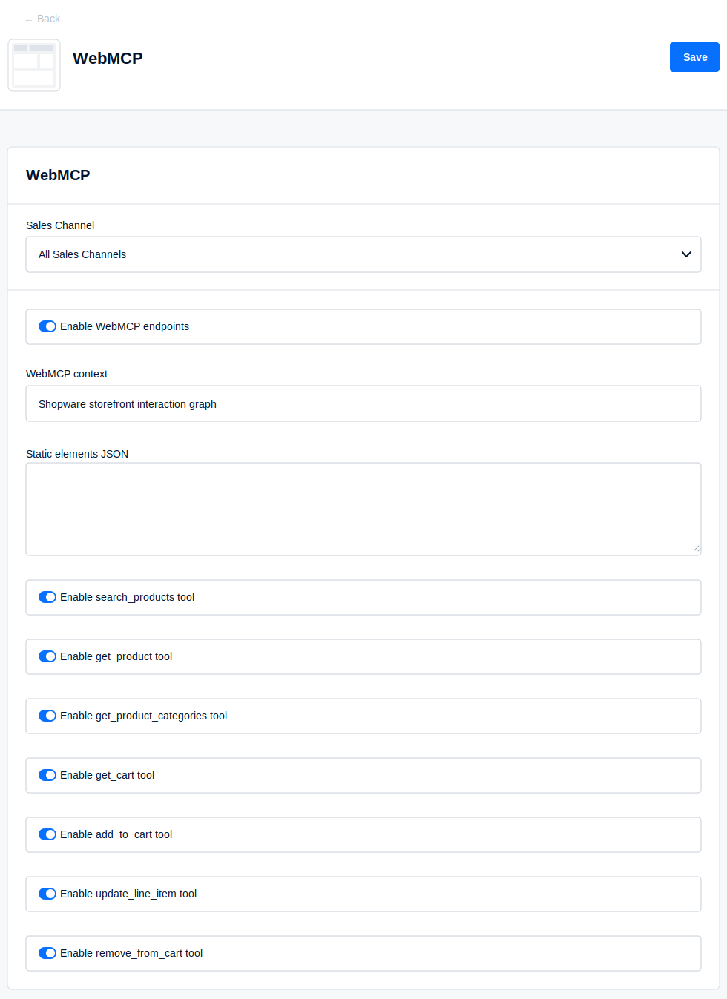

# Shopware WebMCP Plugin

This repository contains a Shopware 6 plugin that adds WebMCP support to storefronts. 

It publishes a WebMCP side-car document and registers browser-side tools for agentic product discovery,
category discovery, and cart operations. 

## Research Preview

> **Status: Research preview.** This plugin is experimental and is not intended
> for production use. It is designed to help developers explore and evaluate WebMCP
> in Shopware storefronts while the technology is still new and evolving.
>
> Use it only in controlled test or development environments. Before considering any
> production rollout, carefully validate the behavior in your own storefront, review
> the exposed tool surface, and complete your normal security, privacy, and QA review.

## What Is WebMCP?

WebMCP is a browser-facing model context pattern that lets a website publish
structured context and callable tools for AI-capable clients. Instead of forcing
an assistant to infer product, category, and cart state from rendered HTML, a
storefront can expose explicit tool contracts with validated inputs and
structured outputs. Learn more in the official [WebMCP repository](https://github.com/webmachinelearning/webmcp).

## Why It Matters

For Shopware merchants, WebMCP can make storefronts easier for AI assistants to
understand and operate without changing the shopper-facing theme. Product search,
product detail lookup, category discovery, and cart actions become explicit,
bounded capabilities rather than fragile DOM scraping tasks.

For the Shopware community, this plugin provides a small, inspectable reference
for exploring how WebMCP-style tools can fit into existing storefront,
configuration, session, and Store API boundaries.

## What This Plugin Does

When enabled, this plugin lets AI-capable browsers and assistants interact with a Shopware storefront through structured catalog and cart tools instead of scraping the rendered page.

An agent can search products, inspect product details, browse categories, read the current cart, and prepare cart changes through bounded tool calls. 

The plugin does not handle checkout, payment, private backend operations, or privileged merchant workflows.

## Requirements

- Shopware 6 installation.
- PHP `^8.2`, matching the Composer platform configuration.
- Docker for the repository QA workflow.
- Bun for TypeScript storefront runtime development.
- Host PHP and Composer are optional for local development because QA runs in Docker.

## Installation

Download the plugin here:

https://github.com/agentic-commerce-lab/web-mcp-plugin/releases/download/latest-main/SwagWebMcp.zip

Then upload the zip file in Shopware Admin.

Alternatively, clone this repository into your Shopware installation under
`custom/plugins`.

After installation, enable or configure the plugin in Shopware Admin.

## Configuration

Shopware renders these settings in the plugin configuration screen in the Admin
panel:



- `enabled`: enables the public WebMCP document endpoint and browser tools.
- `context`: human-readable context for the WebMCP document.
- `searchProductsToolEnabled`: enables the product search `document.modelContext` tool.
- `getProductToolEnabled`: enables the product detail `document.modelContext` tool.
- `getProductCategoriesToolEnabled`: enables the product category `document.modelContext` tool.
- `getCartToolEnabled`: enables the cart read `document.modelContext` tool.
- `addToCartToolEnabled`: enables the cart mutation `document.modelContext` tool.
- `updateLineItemToolEnabled`: enables the cart line item update `document.modelContext` tool.
- `removeFromCartToolEnabled`: enables the cart removal `document.modelContext` tool.

## Test
For native WebMCP testing, follow Chrome's
[WebMCP setup guide](https://developer.chrome.com/docs/ai/webmcp), enable
`chrome://flags/#enable-webmcp-testing`, and relaunch Chrome. To inspect native
tool registration, install the
[WebMCP Model Context Tool Inspector](https://chromewebstore.google.com/detail/webmcp-model-context-tool/gbpdfapgefenggkahomfgkhfehlcenpd)
Chrome extension.

Open a storefront page in Chrome and check the WebMCP runtime in the browser
console. For example:

```js
document.webMcp.getDocument()
document.modelContext.getTools()
```

Replace placeholder values such as `<product-sku>` and `<cart-line-item-id>`
with values from your storefront.

## TypeScript Build

The browser runtime is maintained in TypeScript source files under
`src/Resources/public` and `src/Resources/app/storefront/src`. The generated
JavaScript files stay committed in the same paths because Shopware and the
public fallback script load those `.js` assets directly.

After changing the TypeScript source, rebuild the JavaScript with Bun:

```sh
bun run build
```

Use `bun run build`, not `bun build`. The latter invokes Bun's built-in
bundler directly and requires explicit entrypoints.

To type-check the TypeScript source without emitting files, run:

```sh
bun run check
```

For iterative development, use:

```sh
bun run build:watch
```

The build uses Bun's TypeScript transpiler file-for-file so the emitted
JavaScript keeps the same module layout and public asset paths that the plugin
currently exposes.

## Tool Reference

All tools return WebMCP-style results with `content` text and
`structuredContent` data. Product lookup tools use the Shopware Store API with
customer context. Cart mutation tools use storefront cart routes, publish a cart
update event, and request best-effort storefront cart UI refreshes after
successful mutations.

| Tool | Input | Structured output |
| --- | --- | --- |
| `shopware_webmcp_search_products` | Optional `query`; optional `limit` from `1` to `20`, default `5`. | `query`, `count`, `total`, `products`. |
| `shopware_webmcp_get_product` | Exactly one of `id`, `sku`, or same-origin product `url`. | `lookup`, `product`. |
| `shopware_webmcp_get_product_categories` | Optional `scope`: `tree` or `product`; optional `sku` or same-origin `url`. `sku` implies `product` scope. | `lookup`, `scope`, `source`, `sourceUrl`, `count`, `activeCategoryIds`, `categories`, `tree`. |
| `shopware_webmcp_get_cart` | No input properties. | `cart`. |
| `shopware_webmcp_add_to_cart` | Exactly one of `id`, `sku`, or same-origin product `url`; optional `quantity` from `1` to `100`, default `1`. | `added`, `cart`. |
| `shopware_webmcp_update_line_item` | Exactly one of `lineItemId`, `id`, `sku`, or same-origin product `url`; required `quantity` from `0` to `100`. Quantity `0` removes the line item. | `updated`, `cart`, or `skipped` with `reason`. |
| `shopware_webmcp_remove_from_cart` | Exactly one of `lineItemId`, `id`, `sku`, or same-origin product `url`; optional `quantity` from `1` to `100`, default `1`. | `removed`, `cart`. |


## Extend

To add or change browser tools, keep the public fallback runtime and storefront
plugin import in sync. Make source changes in the TypeScript files and run
`bun run build` to refresh the generated JavaScript. Changes that emit
`src/Resources/public/webmcp-model-context.js` affect both the direct public
fallback script and the Shopware storefront plugin import.

Use the existing vanilla TypeScript module style in
`src/Resources/public/webmcp-model-context`. Keep tool inputs and outputs
stable, especially `structuredContent`, unless the change intentionally updates
the WebMCP contract.

When extending configuration, update the Shopware Admin configuration,
service wiring, routes, Twig data attributes, storefront runtime behavior, and
this README together.

## Security & Limits

- Do not expose private backend credentials in storefront code or plugin config.
- The Store API access key is a storefront value used by Shopware browser clients.
- Cart read and mutation requests use same-origin storefront session cookies.
- CSRF tokens are read from the storefront when available and sent with cart mutation requests.
- Tool inputs are validated and normalized before Store API or storefront cart requests are made.
- Do not log secrets, tokens, credentials, storefront session identifiers, CSRF tokens, or raw sensitive user/cart data.
- Normalize and constrain URLs, selectors, HTTP methods, quantities, product identifiers, and other user-controllable values before emitting or using them.

Known limitations:

- The plugin depends on storefront context; `/webmcp/cart` returns `400` when a request does not receive a Shopware sales channel context. Test from a storefront route rather than an admin or CLI context.
- If product tools fail with `401` or `403`, the storefront page may not include a valid sales channel Store API access key or the current sales channel may not allow Store API product access.
- If `get_cart` returns `404`, the plugin or `getCartToolEnabled` may be disabled.
- If cart mutation tools update the session but the storefront UI does not refresh, the active theme may not register Shopware's standard cart widget or offcanvas cart plugins, or may replace the standard checkout wrapper markup. The runtime requests best-effort header cart refreshes, updates open cart sidebars in place, and refreshes the rendered cart page fragment when the shopper is already on `/checkout/cart`.
- Browser-side native tool registration depends on Chrome's WebMCP testing support; `document.modelContext` remains available for manual console testing.

## Contributions

We welcome feedback and contributions from the community. If you test this plugin,
please share what you learn with the Agentic Commerce Lab by opening a GitHub issue
with your findings, questions, or suggested improvements.

Pull requests are also welcome, especially for bug fixes, documentation improvements,
storefront compatibility notes, and small enhancements that make the plugin easier
to evaluate. For larger changes, please open an issue first so we can discuss the
direction before implementation.

## License

See [LICENSE](LICENSE).
