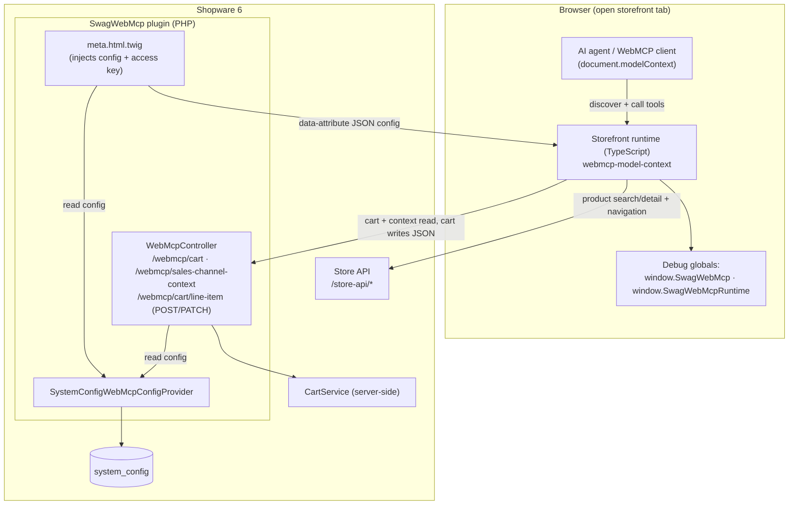
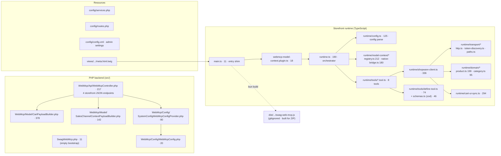
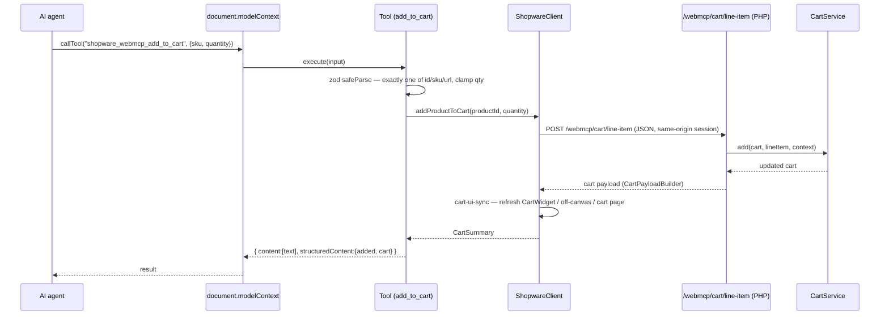
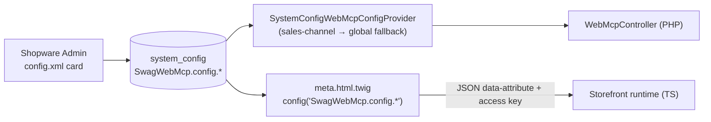
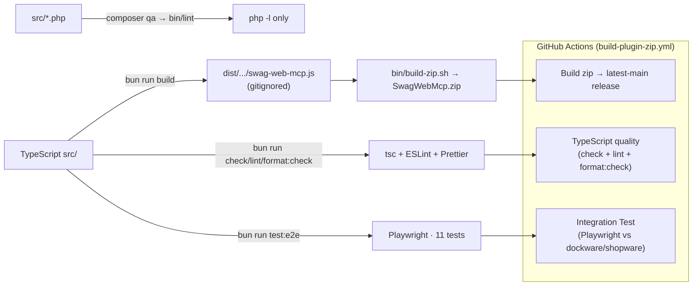

# WebMCP Plugin Architecture Overview (IST)

Date: 2026-07-17 (revised 2026-07-18)
Status: Accepted (describes the current implementation, not a target state)

> This document describes the **current ("IST") architecture** of the Shopware
> WebMCP plugin. It records what exists and why, not what should change.
>
> **Revision 2026-07-18** — updated to the state after the TypeScript foundation
> work (ADR 0003), the Store-API category migration (ADR 0001), the integration
> test suite (ADR 0002), the server-side cart write endpoints (ADR 0004 / cart
> implementation plan), and the move to a standalone Dockware dev shop. The
> notable characteristics from the original ADR are now mostly resolved — see
> §9. The remaining backlog lives in
> [`specs/0001-improvements-and-roadmap.md`](specs/0001-improvements-and-roadmap.md).

## 1. Context

- Package: `shopware/web-mcp`, plugin class `Swag\WebMcp\SwagWebMcp`.
- Platform: Shopware `>=6.6.10.18 <6.8.0`, PHP `^8.2`.
- Purpose: expose a Shopware 6 storefront as a set of **WebMCP tools** so that
  AI-capable browsers can search products, inspect products, browse categories,
  read/prepare the cart, read the sales channel context, and navigate — through
  structured, validated tool calls instead of scraping rendered HTML.
- Status: **research preview**, catalog + cart only. No checkout, payment,
  account, or admin operations.
- WebMCP baseline: **`document.modelContext` is the single source of truth.** The
  runtime registers tools into `document.modelContext` (with compatibility shims
  for `navigator.modelContext` / experimental testing APIs). The plugin no longer
  publishes a bespoke `.wmcp` side-car document — that dual contract was retired.

## 2. System context

**Key boundary:** the agent never leaves the merchant origin. It uses the
shopper's existing session (cookies + `sw-context-token`) and the public Store
API access key that Shopware already exposes to the storefront. Product and
category reads go through the **Store API**; cart reads/writes and the sales
channel context go through the plugin's own **storefront-scoped JSON endpoints**,
which resolve the shopper's `SalesChannelContext` and operate the cart with
Shopware's server-side `CartService`. Agent and shopper therefore share one cart.

## 3. Component / file map

The runtime is now split by responsibility — `transport/` (HTTP + token
discovery), `domain/` (product & category normalizers), `model-context/`
(registry + native bridge), and `tools/` (a `defineTool` factory plus one file
per tool). The former god modules are gone; the only files over ~250 lines are:

| File | Lines | Role |
| --- | --- | --- |
| `Model/CartPayloadBuilder.php` | 378 | cart → JSON payload |
| `runtime/shopware-client.ts` | 336 | Store API + cart/context adapter over `transport/` + `domain/` |
| `runtime/cart-ui-sync.ts` | 294 | best-effort storefront cart-UI refresh after mutations |

## 4. PHP backend

- **Bootstrap** — `SwagWebMcp.php` is an empty `final class extends Plugin` (no
  lifecycle hooks). PSR-4 root `Swag\WebMcp\` → `src/`; subtree split into
  `Api/`, `Config/`, `Model/`.
- **Endpoints** — `WebMcpController` is a plain service (not
  `StorefrontController`) wired with `controller.service_arguments`. All routes
  are storefront-scoped (`_routeScope: storefront`, `auth_required: false`,
  `XmlHttpRequest: true`) and never cached:

  | Route | Method | Name | Purpose | Disabled behavior |
  | --- | --- | --- | --- | --- |
  | `/webmcp/cart` | GET | `…cart` | structured cart read | `404` (tool off), `400` (no context) |
  | `/webmcp/sales-channel-context` | GET | `…sales_channel_context` | read-only sales channel/language/currency/customer-group/country/tax/login state | `404`, `400` |
  | `/webmcp/cart/line-item` | POST | `…cart.add` | add `quantity` of a product (relative) | `404`, `400` |
  | `/webmcp/cart/line-item` | PATCH | `…cart.update` | set exact target quantity (declarative, idempotent); `0` removes; adds if absent | `404`, `400` |

- **Cart writes are server-side.** `writeLineItem()` resolves the shopper's
  `SalesChannelContext`, decodes a JSON body (`productId`, `quantity`), and drives
  Shopware's `CartService` (`add` / `changeQuantity` / `remove`) directly. Line
  item ids are keyed to the product id so a product stays addressable across
  add/update/remove. Quantities are validated (`0…100`, add default `1`). No CSRF
  token or form-encoded storefront checkout route is involved anymore.
- **Payload builders** — `CartPayloadBuilder` serializes the cart;
  `SalesChannelContextPayloadBuilder` serializes the read-only context.
- **Config** — `WebMcpConfigProviderInterface` → `SystemConfigWebMcpConfigProvider`
  reads prefix `SwagWebMcp.config.`, with sales-channel → global fallback and
  robust bool coercion.

## 5. Storefront runtime & tool call flow

Bootstrap chain: `meta.html.twig` injects a JSON `<script>` config block →
`main.ts` imports the runtime and registers the plugin with `PluginManager` →
`webmcp-model-context.plugin.ts` calls `bootstrapWebMcpModelContext` →
`runtime.ts` parses config (`config.ts`), registers the enabled tools via the
`defineTool` factory, exposes debug globals, and bridges into the native
`modelContext` API (`model-context/`).

**Native bridging:** `model-context/native-bridge.ts` registers tools into the
first available native host among `navigator.modelContext`,
`document.modelContext`, and `navigator.modelContextTesting`, tolerating multiple
call signatures for cross-preview compatibility and keeping a fallback registry
so disabled tools are always removed. `model-context/registry.ts` wraps
`document.modelContext.getTools`/`callTool` with idempotent guards.

**Transports in `ShopwareClient`** (over `transport/` + `domain/`):

- **Store API** (`POST /store-api/*`) with `sw-access-key` + `sw-context-token`
  headers; captures and persists the returned context token. Used for product
  search/detail and category navigation.
- **Plugin JSON endpoints** (`/webmcp/cart`, `/webmcp/sales-channel-context`,
  `POST|PATCH /webmcp/cart/line-item`) for cart read/write and context.
- Storefront `/checkout/*` routes are used only for **token discovery** and
  **best-effort cart-UI refresh** (`cart-ui-sync.ts`), never for cart mutations.

## 6. Tool surface

Eight tools, all prefixed `shopware_webmcp_`, all built with the `defineTool`
factory: a single **zod** input schema produces both the runtime validator and
the advertised JSON Schema, so the two cannot drift. Tools carry WebMCP safety
annotations (`readOnlyHint`, `untrustedContentHint`) and return
`{ content: [{type:'text', text}], structuredContent }`.

| Tool | Input | Output keys | Data source |
| --- | --- | --- | --- |
| `search_products` | `query?` (≤120), `limit?` (1–20, def 5) | `query, count, total, products` | Store API `/search` |
| `get_product` | one of `id`/`sku`/`url` | `lookup, product` | Store API `/product/{id}` |
| `get_product_categories` | `scope?` (tree\|product), one of `id`/`sku`/`url` for `product` | `lookup, scope, source, sourceUrl, count, activeCategoryIds, categories, tree` | **Store API navigation** |
| `get_cart` | none | `cart` | `/webmcp/cart` |
| `add_to_cart` | one of id/sku/url + `quantity?` (1–100) + `showCartOverlay?` | `added, cart` | `POST /webmcp/cart/line-item` |
| `update_line_item` | one of lineItemId/id/sku/url + **required** `quantity` (0–100); `0` removes | `updated, cart` or `skipped` | `PATCH /webmcp/cart/line-item` |
| `get_sales_channel_context` | none | `salesChannelContext` | `/webmcp/sales-channel-context` |
| `navigate` | same-origin storefront `url`/path | `navigatedTo` | `window.location` (same-origin) |

> Removal is handled by `update_line_item` with `quantity: 0` (declarative,
> idempotent) — there is no separate `remove_from_cart` tool. `get_product_categories`
> now uses the Store API navigation endpoint (ADR 0001), not DOM scraping.

## 7. Configuration flow

Admin settings: `enabled`, `context` (text), and 8 per-tool toggles
(`searchProductsToolEnabled`, `getProductToolEnabled`,
`getProductCategoriesToolEnabled`, `getCartToolEnabled`, `addToCartToolEnabled`,
`updateLineItemToolEnabled`, `getSalesChannelContextToolEnabled`,
`navigateToolEnabled`) — all default true. The former `staticElementsJson`
setting was removed with the `.wmcp` document.

The config reaches the runtime in two independent ways: PHP reads it via the
provider (endpoints re-check the relevant toggle); the storefront reads it via
Twig, which emits the enabled toggles and the public `storeApiAccessKey` into a
`data-*` attribute the runtime parses.

## 8. Build, QA & release

- **Local dev shop** — a full Shopware runs on demand in a single
  [Dockware](https://dockware.io) container (`dockware/dev`) via the `shop`
  service in `docker-compose.yml`. `bin/shop.sh` + `bun run shop:*` wrap boot,
  storefront transpile + plugin install, and teardown; ports and the Shopware
  version come from `.env`. The plugin repository is self-contained — no
  surrounding Shopware install is required.
- **TS quality** — `bun run check` (`tsc --noEmit`, split browser/node
  tsconfigs), `bun run lint` (ESLint), `bun run format` (Prettier). All three run
  in the CI "TypeScript quality" job.
- **Tests** — 11 Playwright integration tests (`tests/e2e`) drive
  `document.modelContext` against a real shop (`bun run test:e2e`, ADR 0002), run
  locally against the dev shop and in CI against `dockware/shopware`.
- **PHP QA** — `composer qa` / `docker compose run --rm qa` still run **only PHP
  `php -l` syntax linting** (no PHPStan/Psalm/CS-Fixer/PHPUnit).
- **Release** — `bin/build-storefront-dist.ts` bundles `main.ts` with `Bun.build`
  (IIFE, minified) into `dist/` (gitignored, built fresh); `bin/build-zip.sh`
  type-checks, rebuilds, and packages `SwagWebMcp.zip`. The dev-shop files
  (`docker-compose.yml`, `.env*`, `bin/shop.sh`) are excluded from the ZIP.

## 9. Notable IST characteristics

Most of the concerns recorded in the original ADR have since been addressed.

**Resolved since the 2026-07-17 baseline:**

- **Dual contract → single source of truth.** The bespoke `.wmcp` side-car
  document and its PHP/TS re-implementation were retired; `document.modelContext`
  is now the only contract, and each tool's zod schema generates its JSON Schema.
- **God modules split.** `shopware-client.ts` 1302 → 336 (over `transport/` +
  `domain/`); `runtime.ts` 897 → 190 (config, model-context registry, and native
  bridge extracted); `get-product-categories.tool.ts` 876 → 123 (Store API
  instead of a DOM tree-inference engine, ADR 0001).
- **Per-tool boilerplate → factory.** The "exactly one of id/sku/url" validator,
  quantity clamping, and constants live once behind `defineTool` + shared zod
  `schemas.ts`.
- **DOM scraping removed.** `get_product_categories` uses the Store API
  navigation endpoint (ADR 0001).
- **0% tests → integration suite.** 11 Playwright tests plus a CI "TypeScript
  quality" gate (ADR 0002, 0003).
- **Safety hints added.** Tools declare `readOnlyHint` / `untrustedContentHint`.
- **AGENTS.md corrected** to the TypeScript runtime under `app/storefront/src`.

**Still open (see the improvement spec):**

- **PHP has no static analysis or unit tests** — `composer qa` remains `php -l`
  only; there is no PHPStan/Psalm/PHPUnit.
- **`CartPayloadBuilder.php` (378) and `cart-ui-sync.ts` (294)** remain the
  largest units; cart-UI refresh stays inherently best-effort and theme-dependent.
- **Storefront context dependency** — cart/context endpoints return `400` without
  a sales channel context (test from a storefront route, not admin/CLI).
