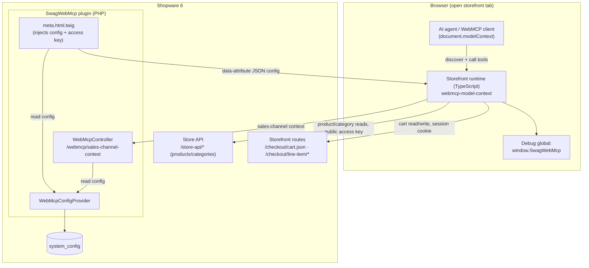
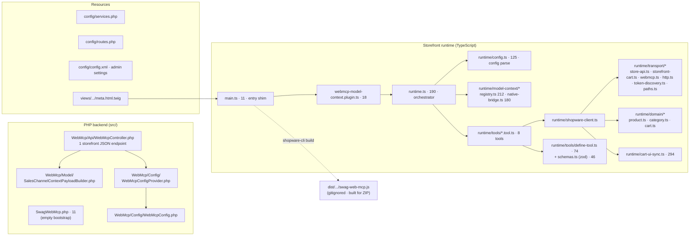
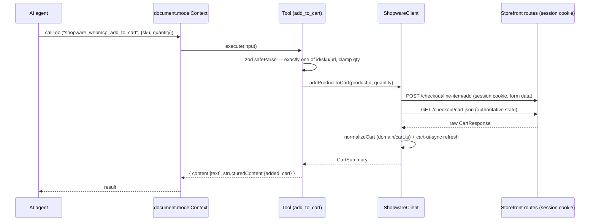
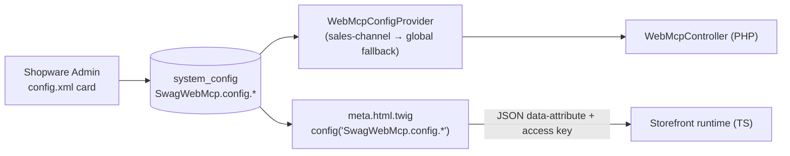
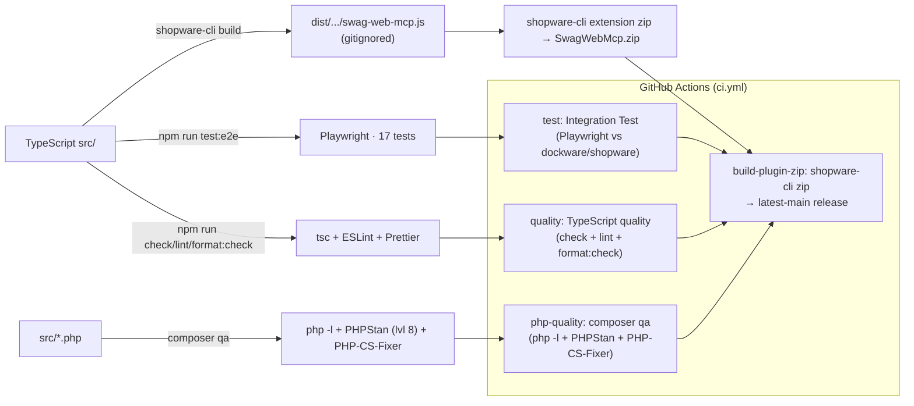

# WebMCP Plugin Architecture Overview (IST)

Date: 2026-07-17 (revised 2026-07-18)
Status: Accepted (describes the current implementation, not a target state)

> This document describes the **current ("IST") architecture** of the Shopware
> WebMCP plugin. It records what exists and why, not what should change.
>
> Reflects the state after the TypeScript foundation work (ADR 0003), the Store-API
> category migration (ADR 0001), the integration test suite (ADR 0002), the cart over
> Shopware's session-based storefront routes (ADR 0004 / cart implementation plan), and
> the standalone Dockware dev shop. The remaining backlog lives in
> [`specs/0001-improvements-and-roadmap.md`](specs/0001-improvements-and-roadmap.md).

## 1. Context

- Package: `shopware/web-mcp`, plugin class `Swag\WebMcp\SwagWebMcp`.
- Platform: Shopware `>=6.6.10.18 <6.8.0`, PHP `^8.2`.
- Purpose: expose a Shopware 6 storefront as a set of **WebMCP tools** so that
  AI-capable browsers can search products, inspect products, browse categories,
  read/prepare the cart, read the sales channel context, and navigate — through
  structured, validated tool calls instead of scraping rendered HTML.
- Status: **research preview**, catalog + cart only. No checkout, payment,
  account, or admin operations.
- WebMCP baseline: **`document.modelContext` is the single source of truth.** The
  runtime registers tools into `document.modelContext` (with compatibility shims
  for `navigator.modelContext` / experimental testing APIs). The plugin no longer
  publishes a bespoke `.wmcp` side-car document — that dual contract was retired.

## 2. System context

**Key boundary:** the agent never leaves the merchant origin. Product/category reads go
through the **Store API** with the public sales-channel access key (anonymous context).
The **cart** goes through Shopware's **session-based storefront routes**
(`/checkout/cart.json`, `/checkout/line-item/*`), authenticated by the shopper's session
cookie — **no context token in the browser** — so agent and shopper share one cart by
construction (ADR 0004). The curated, PII-safe sales-channel context stays on the plugin's
own `/webmcp/sales-channel-context` endpoint.

## 3. Component / file map

The runtime is split by responsibility — `transport/` (Store API for reads,
storefront-cart for the session-based cart, the `/webmcp` client, token discovery),
`domain/` (product, category & cart normalizers), `model-context/` (registry + native
bridge), and `tools/` (a `defineTool` factory plus one file per tool). `ShopwareClient`
drives the cart over the session-based storefront routes (`cart.json` +
`/checkout/line-item/*`) and `domain/cart.ts` projects the raw `CartResponse` in the
frontend. `runtime/cart-ui-sync.ts` does the best-effort storefront cart-UI refresh after
mutations.

## 4. PHP backend

- **Bootstrap** — `SwagWebMcp.php` is an empty `final class extends Plugin` (no
  lifecycle hooks). PSR-4 root `Swag\WebMcp\` → `src/`; subtree split into
  `Api/`, `Config/`, `Model/`.
- **Endpoints** — `WebMcpController` is a plain service (not
  `StorefrontController`) wired with `controller.service_arguments`. It is one
  storefront-scoped (`_routeScope: storefront`, `auth_required: false`,
  `XmlHttpRequest: true`), never-cached read:

  | Route | Method | Name | Purpose | Disabled behavior |
  | --- | --- | --- | --- | --- |
  | `/webmcp/sales-channel-context` | GET | `…sales_channel_context` | read-only sales channel/language/currency/customer-group/country/tax/login state | `404`, `400` |

- **The cart runs over stock storefront routes, not PHP** (ADR 0004). The plugin has no
  cart route and no context-token route; the cart tools call Shopware's own
  `/checkout/cart.json` (read) and `/checkout/line-item/*` (write) with the session cookie.
- **Config** — `WebMcpConfigProviderInterface` → `WebMcpConfigProvider` reads prefix
  `SwagWebMcp.config.`, with sales-channel → global fallback and robust bool coercion.

## 5. Storefront runtime & tool call flow

Bootstrap chain: `meta.html.twig` injects a JSON `<script>` config block →
`main.ts` imports the runtime and registers the plugin with `PluginManager` →
`webmcp-model-context.plugin.ts` calls `bootstrapWebMcpModelContext` →
`runtime.ts` parses config (`config.ts`), registers the enabled tools via the
`defineTool` factory, exposes debug globals, and bridges into the native
`modelContext` API (`model-context/`).

**Native bridging:** `model-context/native-bridge.ts` registers tools into the
first available native host among `navigator.modelContext`,
`document.modelContext`, and `navigator.modelContextTesting`, tolerating multiple
call signatures for cross-preview compatibility and keeping a fallback registry
so disabled tools are always removed. `model-context/registry.ts` wraps
`document.modelContext.getTools`/`callTool` with idempotent guards.

**Transports in `ShopwareClient`** (over `transport/` + `domain/`):

- **Store API** (`/store-api/*`, `transport/store-api.ts`) with the public `sw-access-key`;
  anonymous context. Used for product search/detail and category navigation.
- **Storefront cart routes** (`transport/storefront-cart.ts`, session cookie, no token):
  `GET /checkout/cart.json` (read → `CartResponse`), `POST /checkout/line-item/add`
  (additive), `…/change-quantity/{id}` (target), `…/delete/{id}` (remove). Each write is
  followed by a `cart.json` read for the authoritative state.
- **Plugin JSON endpoint** (`/webmcp/sales-channel-context`) for the curated, PII-safe
  sales-channel context read.
- Storefront `/checkout/*` routes are also used for the **best-effort cart-UI refresh**
  (`cart-ui-sync.ts`).

## 6. Tool surface

Eight tools, all prefixed `shopware_webmcp_`, all built with the `defineTool`
factory: a single **zod** input schema produces both the runtime validator and
the advertised JSON Schema, so the two cannot drift. Tools carry WebMCP safety
annotations (`readOnlyHint`, `untrustedContentHint`) and return
`{ content: [{type:'text', text}], structuredContent }`.

| Tool | Input | Output keys | Data source |
| --- | --- | --- | --- |
| `search_products` | `query?` (≤120), `limit?` (1–20, def 5) | `query, count, total, products` | Store API `/search` |
| `get_product` | one of `id`/`sku`/`url` | `lookup, product` | Store API `/product/{id}` |
| `get_product_categories` | `scope?` (tree\|product), one of `id`/`sku`/`url` for `product` | `lookup, scope, source, sourceUrl, count, activeCategoryIds, categories, tree` | **Store API navigation** |
| `get_cart` | none | `cart` | Storefront `GET /checkout/cart.json` |
| `add_to_cart` | one of id/sku/url + `quantity?` (1–100) + `showCartOverlay?` | `added, cart` | Storefront `POST /checkout/line-item/add` (additive) |
| `update_line_item` | one of id/sku/url + **required** `quantity` (0–100); `0` removes | `updated, cart` | Storefront `…/change-quantity/{id}` / `…/delete/{id}` |
| `get_sales_channel_context` | none | `salesChannelContext` | `/webmcp/sales-channel-context` |
| `navigate` | same-origin storefront `url`/path | `navigatedTo` | `window.location` (same-origin) |

> Removal is handled by `update_line_item` with `quantity: 0` (declarative,
> idempotent) — there is no separate `remove_from_cart` tool. `get_product_categories`
> now uses the Store API navigation endpoint (ADR 0001), not DOM scraping.

## 7. Configuration flow

Admin settings: `enabled`, `context` (text), and 8 per-tool toggles
(`searchProductsToolEnabled`, `getProductToolEnabled`,
`getProductCategoriesToolEnabled`, `getCartToolEnabled`, `addToCartToolEnabled`,
`updateLineItemToolEnabled`, `getSalesChannelContextToolEnabled`,
`navigateToolEnabled`) — all default true. The former `staticElementsJson`
setting was removed with the `.wmcp` document.

The config reaches the runtime in two independent ways: PHP reads it via the
provider (the one remaining endpoint re-checks `enabled` / the sales-channel-context
toggle); the storefront reads it via Twig, which emits the enabled toggles and the
public `storeApiAccessKey` into a `data-*` attribute the runtime parses. The cart
tools are Store-API-backed, so — like `search_products` / `get_product` — their
per-tool toggles gate **client-side registration**; there is no server-side cart
route left to gate.

## 8. Build, QA & release

The three checks — `test`, `quality`, and `php-quality` — run in parallel;
`build-plugin-zip` runs only after all three pass (`needs: [test, quality,
php-quality]`), so a cheap PHPStan/CS-Fixer failure surfaces without waiting on
the integration test.

- **Local dev shop** — a full Shopware runs on demand in a single
  [Dockware](https://dockware.io) container (`dockware/dev`) via the `shop`
  service in `docker-compose.yml`. `bin/shop.sh` + `npm run shop:*` wrap boot,
  storefront transpile + plugin install, and teardown; ports and the Shopware
  version come from `.env`. The plugin repository is self-contained — no
  surrounding Shopware install is required.
- **TS quality** — `npm run check` (`tsc --noEmit`, split browser/node
  tsconfigs), `npm run lint` (ESLint), `npm run format` (Prettier). All three run
  in the CI "TypeScript quality" job.
- **Tests** — 17 Playwright integration tests (`tests/e2e`) drive
  `document.modelContext` against a real shop (`npm run test:e2e`, ADR 0002), run
  locally against the dev shop and in CI against `dockware/shopware`. They include
  three cross-login cart-coherence tests (token rotation + guest→customer merge,
  ADR 0004).
- **PHP QA** — `composer qa` / `docker compose run --rm qa` run `php -l` syntax
  linting (`bin/lint`), **PHPStan** at level 8 (`phpstan.neon.dist`, clean, no
  baseline), and **PHP-CS-Fixer** in dry-run/check mode (`.php-cs-fixer.dist.php`,
  `@PSR12` + `@Symfony` + risky, `declare_strict_types`). `composer cs-fix`
  applies fixes. There is still no PHPUnit/Psalm.
- **Release** — `shopware-cli` builds `main.ts` with Shopware's own storefront build
  (Webpack) into `dist/` (gitignored, built fresh) and packages `SwagWebMcp.zip`
  (`shopware-cli extension zip`, honouring `.shopware-extension.yml`). Locally via
  `bin/build-zip.sh`; in CI via `shopware/github-actions/build-zip` (ADR 0007). Dev
  and TS-tooling files are excluded from the ZIP via `pack.excludes`.

## 9. Notable IST characteristics

Most of the concerns recorded in the original ADR have since been addressed.

**Resolved since the 2026-07-17 baseline:**

- **Dual contract → single source of truth.** The bespoke `.wmcp` side-car
  document and its PHP/TS re-implementation were retired; `document.modelContext`
  is now the only contract, and each tool's zod schema generates its JSON Schema.
- **God modules split.** `shopware-client.ts` 1302 → 336 (over `transport/` +
  `domain/`); `runtime.ts` 897 → 190 (config, model-context registry, and native
  bridge extracted); `get-product-categories.tool.ts` 876 → 123 (Store API
  instead of a DOM tree-inference engine, ADR 0001).
- **Per-tool boilerplate → factory.** The "exactly one of id/sku/url" validator,
  quantity clamping, and constants live once behind `defineTool` + shared zod
  `schemas.ts`.
- **DOM scraping removed.** `get_product_categories` uses the Store API
  navigation endpoint (ADR 0001).
- **0% tests → integration suite.** 17 Playwright tests plus a CI "TypeScript
  quality" gate (ADR 0002, 0003).
- **Safety hints added.** Tools declare `readOnlyHint` / `untrustedContentHint`.
- **AGENTS.md corrected** to the TypeScript runtime under `app/storefront/src`.

**Still open (see the improvement spec):**

- **PHP has no unit tests** — `composer qa` now runs `php -l`, PHPStan (level 8,
  clean) and PHP-CS-Fixer, but there is still no PHPUnit/Psalm.
- **`cart-ui-sync.ts` stays the largest runtime unit**; cart-UI refresh is
  inherently best-effort and theme-dependent.
- **Storefront context dependency** — the cart rides the storefront session cookie
  (stock `/checkout/*` routes) and the `/webmcp/sales-channel-context` endpoint returns
  `400` without a sales channel context, so test from a storefront route, not admin/CLI.
  An agent without the shopper's session (e.g. cross-origin) cannot see or change the cart.
