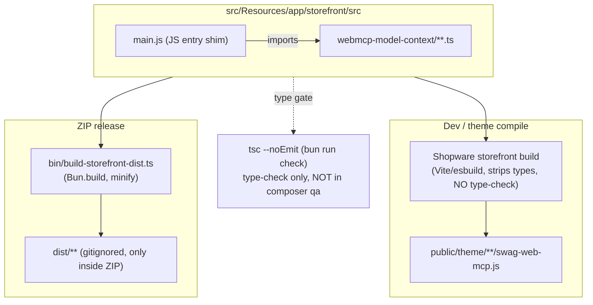
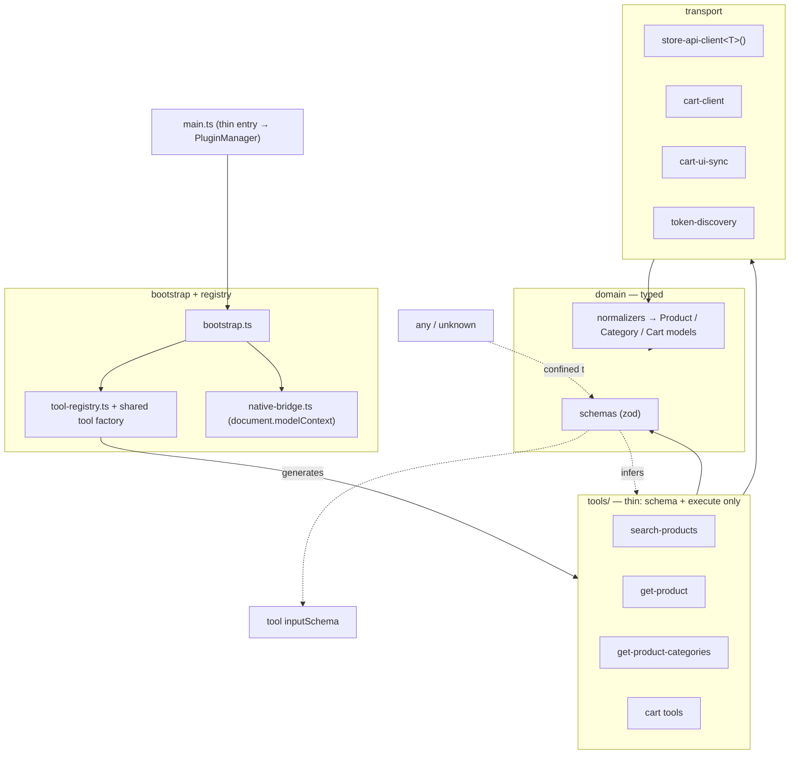
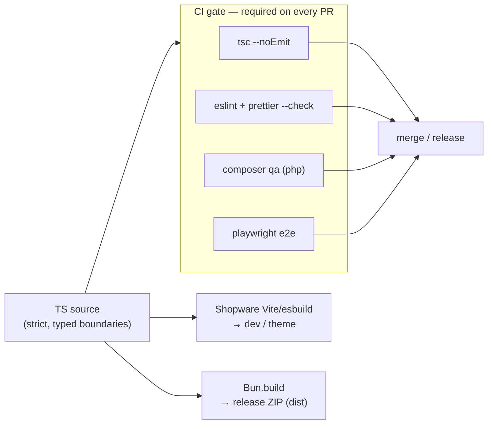
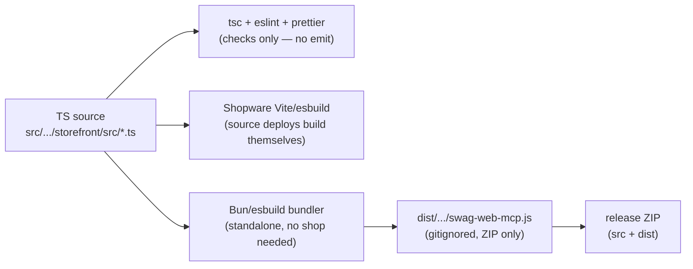

# ADR 0003 — TypeScript integration, architecture & conventions (open-source readiness)

Date: 2026-07-17
Status: Draft
Relates to: [Architecture Overview](../Architecture.md) ·
[ADR 0002 — Testing Strategy](0002-testing-strategy.md) ·
[Improvements & Roadmap](../specs/0001-improvements-and-roadmap.md) (A1–A3, A7)

## Context

The repository is going to be **open-sourced** as a public Shopware community
reference plugin. That raises the bar: external contributors must be able to read
the storefront runtime, understand the architecture in minutes, and trust the type
safety. Internal review flagged two themes that triggered this ADR:

- Break up the large files, drop the DOM scraping, use the Store API more
  consistently, and add a CI pipeline.
- The TypeScript integration itself is unusual and worth cleaning up.

This ADR records **what is currently strange or weak about the TypeScript setup**
and the **target approach** for an open-source-grade TS codebase: clear structure,
explicit best practices, and state-of-the-art TypeScript usage and integration.

## Current state (IST)

### Build & integration wiring

Facts (verified 2026-07-17):

- **JS entrypoint imports TS.** `main.js` is a `.js` shim (Shopware auto-discovers
  `main.js` as the storefront entrypoint) that imports the TS runtime. `tsconfig`
  therefore turns on `allowJs`+`checkJs` to cover the shim.
- **Two independent compilers build the same code.** Shopware's own storefront
  Vite/esbuild build compiles the TS for dev/theme; a separate `Bun.build`
  (`bin/build-storefront-dist.ts`) produces the release artifact. They can diverge
  (target, TS handling) and must be kept in sync by hand.
- **`tsc` only type-checks (`noEmit`)** — it never builds; emission is Bun (release)
  or Vite/esbuild (dev). The Vite path **strips types without type-checking**, so
  `tsc` is the only type gate — and it is **not part of `composer qa`** (qa = PHP
  `php -l` only). A type error passes qa and only fails at ZIP build / e2e.
- **No linter or formatter.** No ESLint / typescript-eslint / Prettier / Biome
  config exists. No `lint` / `format` scripts.
- **Mixed tool environments in one tsconfig.** A single `tsconfig.json` sets
  `"types":["node"]` and DOM libs and `include`s both `bin/**` (Bun/node scripts)
  and the browser storefront — so Node globals leak into browser code.
- **Stray `package-lock.json`** exists locally (gitignored) although Bun is the
  declared package manager — a confusing signal for contributors.
- `dist/` is **gitignored** and generated fresh for each ZIP (this part is fine).

### Typing quality (runtime `.ts`)

| Signal | Count | Meaning |
| --- | --- | --- |
| `UnknownRecord` (= `Record<string, any>`) | 83 | primary data-flow type; Store API/cart payloads are effectively untyped |
| raw `any` (34 in `shopware-client.ts`) | 44 | untyped API/DOM boundary propagates `any` downstream |
| `: any` annotations | 38 | explicit escape hatches |
| `Promise<any>` | 4 | core request methods (`storeApiRequest`, …) return untyped |
| `as any` casts | 0 | ✅ no unsafe casts |
| `@ts-ignore` / `@ts-expect-error` | 0 | ✅ no suppressed errors |

`strict` is on (good), but the code leans on `UnknownRecord`/`any` at every I/O
boundary instead of real domain types, so `strict` buys little. Tool inputs are
`input = {}` (untyped) then hand-validated, and the JSON Schema and the TS shape are
maintained separately (drift risk).

## What is wrong / strange (summary)

1. **JS-entry + TS-runtime split** and **two build pipelines** for one codebase —
   the unusual integration flagged in review.
2. **Type-checking is not enforced** in the main QA gate.
3. **No lint/format standard** — table stakes for an open-source repo.
4. **Weak typing at the boundaries** — `UnknownRecord`/`any` everywhere; no typed
   Store API / cart / tool-input models; schema ↔ type drift.
5. **One tsconfig for two runtimes** (node + browser).
6. **Structure**: god modules (`shopware-client.ts` ~1300, `runtime.ts` ~900),
   per-tool boilerplate, and the PHP↔TS document contract duplication (A1–A3) make
   the codebase hard for newcomers to navigate.

## Decision (target approach)

### Target state (at a glance)

**Module architecture** — thin tools over a typed domain boundary over a split
transport layer; one schema source feeds both TS types and tool JSON Schemas:

**CI & build** — `tsc`, lint, PHP QA and e2e are one required gate; `any` no longer
slips through, and the two emit paths stay explicit and separate:

### Distribution & build model (the concrete solution)

Not "ship TS **or** JS" — **ship TS source and a pre-built JS bundle**. One source,
two emit channels, plus a separate type/quality gate:

**Why both channels are required:**

| Channel | What compiles the TS | What must be present |
| --- | --- | --- |
| Source deploy (git clone / composer project) | Shopware's Vite build during `bin/build-storefront.sh` / deploy | TS source only |
| ZIP / Store / Admin upload | nothing — the shop loads the **pre-built** JS directly and does **not** build | pre-built `dist/.../swag-web-mcp.js` **inside the ZIP** |

Production shops installing a ZIP usually have no Node/build toolchain, so the
compiled bundle **must** ship in the ZIP. The TS source is also in the ZIP but is
**not** transpiled on those shops.

**Fixed conventions:**
- Compiled path (Shopware kebab-case of the technical name):
  `src/Resources/app/storefront/dist/storefront/js/swag-web-mcp/swag-web-mcp.js`.
- `dist/` stays **gitignored**, regenerated per release, present **only in the ZIP**.
- The standalone bundle must match what Shopware expects: **IIFE, browser target,
  the exact path/filename, minified, registered via `window.PluginManager`** — this
  is what `bin/build-storefront-dist.ts` produces today; keep it, just document it.
- Producing `dist` with a standalone bundler (not Shopware's own build) is the
  deliberate trade-off for a standalone OSS repo with no shop in CI. Acceptable
  because the bundle is trivial (register a PluginManager plugin); the risk is
  transpile divergence from a real shop, mitigated by the e2e test (ADR 0002).

**Release chain (`bin/build-zip.sh`):**
`bun install` → `tsc` (type-check) → eslint/prettier (check) → `bun run build`
(emit `dist`) → package `src` + `dist` → zip.

### 1. Simplify the build/integration story
- Investigate a **`main.ts` entrypoint**. The Shopware storefront build here is
  Vite/esbuild-based and already compiles `.ts` (the Shopware core storefront is
  itself TypeScript), so a `.ts` entrypoint is very likely discovered; if so, drop
  the `main.js` shim and `allowJs`/`checkJs` so the whole runtime is TS.
- Treat **`tsc` as the type authority**, the Shopware Vite/esbuild build as the dev
  compiler, and **Bun.build only for the release ZIP**. Document this explicitly in
  the README/CONTRIBUTING so the two-compiler reality is intentional, not accidental.
- Add `declare`d Bun types (or `@types/bun`) to the build script instead of
  `declare const Bun: any`.

### 2. Enforce TypeScript in CI
- Add `bun run check` (tsc) to the QA gate so type errors fail CI, not only the ZIP
  build. Unify PHP + TS checks into one CI pipeline (composer qa + bun check + lint
  + e2e per [ADR 0002](0002-testing-strategy.md)).

### 3. Adopt lint + format
- **typescript-eslint** (flat config) + **Prettier** (or Biome as an all-in-one).
- Add `lint` / `format` scripts; run in CI; document in CONTRIBUTING.

### 4. Harden tsconfig
- Split configs: `tsconfig.node.json` (bin, Bun/node) vs a storefront config (DOM,
  no node types) with a shared base.
- Add beyond `strict`: `noUncheckedIndexedAccess`, `noImplicitOverride`,
  `exactOptionalPropertyTypes`, `noUnusedLocals`, `noUnusedParameters`,
  `noImplicitReturns`.

### 5. Replace boundary `any` with real types
- Introduce **domain types** for the Store API responses (product, category,
  navigation, cart) and normalize raw payloads into them at the client boundary, so
  `any`/`UnknownRecord` stays confined to the parse layer.
- Consider **zod** (or valibot) for runtime validation of external payloads and tool
  inputs, deriving TS types from the schema — one source of truth for validation +
  type. This also lets tool **JSON Schemas be generated from the same schema**,
  killing the schema↔type drift (and the earlier top-level `oneOf` class of bugs).
- Type the core request methods (`storeApiRequest<T>()`), removing `Promise<any>`.

### 6. Structure for readability (open-source ergonomics)
- Split the god modules along the seams in the Architecture Overview §9 / roadmap A2:
  `store-api-client`, `cart-client`, `*-normalizer`, `cart-ui-sync`,
  `token-discovery`, and a thin `tool-registry` / `native-bridge`.
- A **shared tool factory** + typed `productSelector` schema to remove per-tool
  boilerplate (A3).
- Establish a **single source of truth for the WebMCP document** (A1).
- Add a short **CONTRIBUTING.md + architecture note** so the layering, the build
  paths, and the conventions are discoverable.

## Implementation status (2026-07-17)

Delivered on the `refactor/typescript-foundation` branch: ESLint + Prettier + CI
quality gate; `main.ts` entrypoint (Shopware resolves `main.ts` ahead of `main.js`,
so the JS shim was removed); the `defineTool` + zod tool factory with safety hints;
the `shopware-client.ts` split into `transport/` + `domain/` + `cart-ui-sync`; the
`runtime.ts` model-context registry extracted; and the browser/node tsconfig split
with the stricter flags.

Deferred: the **single-source WebMCP document** (WP6) — making the storefront fetch
the document from the PHP endpoint would change `document.webMcp.getDocument()` from
sync to async, a public API change that needs its own reviewed change and e2e, so it
was intentionally not folded into the runtime split. Full domain-type coverage
(replacing the remaining parse-boundary `any`) is likewise a follow-up, kept separate
to avoid runtime-parse regressions on real Store API payloads.

## Non-goals

- Rewriting working runtime behavior. This is about types, structure, and tooling,
  not changing what the tools do.
- Adopting a heavy framework or bundler. Keep the vanilla-TS + Shopware storefront
  integration; only make it explicit and type-safe.

## Consequences

- **Positive:** readable, contributor-friendly codebase; enforced type safety;
  consistent style; boundary types that make the Store API contract explicit;
  schema/type drift eliminated.
- **Cost:** upfront refactor (typing the Store API surface, splitting modules, wiring
  lint/CI). Best done incrementally: (1) CI + lint + tsconfig, (2) tool factory +
  schema/type unification, (3) module split, (4) domain types.
- **Risk:** introducing zod/domain types touches the client boundary broadly;
  guard with the [ADR 0002](0002-testing-strategy.md) test pyramid before/after.

## Verification

- CI runs `tsc --noEmit`, ESLint, Prettier check, `composer qa`, and the e2e suite,
  all green, on every PR.
- `grep` counts for boundary `any` / `UnknownRecord` trend to near-zero outside the
  parse/validation layer.
- A new contributor can locate "where a tool is defined", "where the Store API is
  called", and "how to add a tool" from the CONTRIBUTING/architecture note alone.
