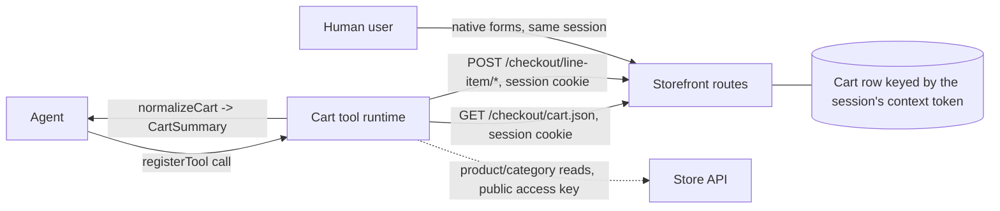

# ADR 0004 — Cart architecture: context, cache-safety, exposure & projection

Date: 2026-07-21
Status: Accepted — implemented on `refactor/typescript-foundation` (not yet merged to `main`)
Relates to: [Architecture Overview](../Architecture.md) ·
[ADR 0001 — Categories via Store API](0001-categories-store-api.md) ·
[ADR 0003 — TypeScript architecture](0003-typescript-architecture.md) ·
[ADR 0006 — Tool discovery contract](0006-tool-discovery-contract.md) ·
[Cart implementation plan](../specs/0003-cart-implementation-plan.md)

> **Single source of truth for the cart.** Records the cart design across four entangled
> questions: context-sync, cache-safety, exposure/semantics, and projection.

## Context

The cart touches four questions:

1. **Context synchronisation** — the agent must operate on the *same* Shopware
   `SalesChannelContext` / cart row as the human shopper.
2. **Cache-safety** — cart/session state must never leak into HTTP-cached full-page HTML.
3. **Exposure & semantics** — imperative executable tools vs. a declarative description of
   page affordances, and with what write semantics.
4. **Projection** — where the raw Shopware cart is shaped into the compact payload the
   tools return.

## Platform facts (verified against `shopware/core`, `v6.7.11.1`)

- **Two request worlds resolve context differently.** Storefront controller routes are
  **session-based**: the `StorefrontSubscriber` promotes the session's `sw-context-token`
  into the request header, so a same-origin request with the session cookie resolves the
  shopper's context and cart — no token needed in the browser
  (`StorefrontSubscriber.php:118-124`). The **Store API** (`/store-api/*`) resolves the
  token from the `sw-context-token` **request header only**; a missing token mints a fresh
  *anonymous* token (`SalesChannelRequestContextResolver.php:44-49`). The session→header
  promotion is storefront-scoped and explicitly excludes `/store-api`
  (`RequestTransformer::isSalesChannelRequired`).
- **The context token is a per-user secret, but a same-origin script can read the
  shopper's own.** It lives server-side in the session and is not rendered into cached
  HTML, a readable cookie, or a response header — so it cannot leak *across users* (the
  HTTP cache is keyed by `sw-cache-hash`, shared between users). However, a
  session-authenticated, uncached route *does* return it: `cart.json`'s body carries
  `token` (see below). So the shopper's own JS — or an XSS on the page — can obtain it,
  and it is exactly the token the Store API would need.
- **Shopware ships no first-class Store API access for storefront JS.** The
  `StoreApiClient` storefront service was removed in 6.5; `HttpClient` is deprecated in
  favour of native `fetch` against storefront controller routes; core exposes neither the
  access key nor the token to JS. Shopware's own cart JS (`add-to-cart.plugin.js`) posts a
  plain `fetch` to the **storefront** `/checkout/line-item/add` route with the session
  cookie — no token, no access key.
- **The storefront exposes a JSON cart read — whose body includes the context token.**
  `GET /checkout/cart.json` (`frontend.checkout.cart.json`, storefront-scoped) delegates to
  the same `AbstractCartLoadRoute` as `/store-api/checkout/cart`, i.e. it returns a
  byte-identical `CartResponse` — session-based, no token needed to *call* it. Its body
  carries `token` (the session context token), so one **could** read it here and drive the
  cart over the Store API with it. We deliberately don't — see Rejected alternatives A.
- **Storefront product/search/navigation routes return HTML, not JSON.** The only `.json`
  storefront route is `cart.json`. Structured product/category data therefore comes from
  the **Store API**, which needs only the **public** sales-channel access key (a
  non-secret, cache-safe, sales-channel-global value) for anonymous reads.

## Two orthogonal axes (avoid conflating "declarative")

- **Axis A — write semantics.** *relative delta* vs. *per-line target* vs. *full-cart
  replace*.
- **Axis B — exposure mechanism.** *imperative* `registerTool` handlers vs. a *declarative*
  description of native forms.

## Decisions

### D1 — Exposure: imperative `registerTool` (Axis B)

The executable contract is **imperative**. The W3C imperative API is stable and can express
add-an-arbitrary-product regardless of the current page. The declarative form API is
deferred (a spec TODO, and it can only surface affordances present on the current page — it
cannot add an arbitrary product from any page).

### D2 — Write semantics: declarative per-line target (Axis A), two product-keyed tools

The canonical write is **per-line target** (`quantity: N` on a product-keyed line):
idempotent, retry-safe, touches only the targeted line. Two product-keyed tools:
`add_to_cart(product, quantity = 1)` (relative) and `update_line_item(product, quantity)`
(target; `0` = remove). Line-item id is keyed to the product id, so tools stay
product-addressable without a DOM lookup.

### D3 — Execution backend: session-based storefront routes

The cart executes over Shopware's **stock storefront controller routes**, authenticated by
the **session cookie** — the same mechanism Shopware's own storefront JS uses. No context
token in the browser, no custom route:

| Tool | Route (storefront-scoped, session cookie) |
| --- | --- |
| `get_cart` | `GET /checkout/cart.json` → `CartResponse` |
| `add_to_cart(pid, qty)` | `POST /checkout/line-item/add`, `lineItems[pid][id|type|referencedId|quantity]` (additive) |
| `update_line_item(pid, N>0)` | present → `POST /checkout/line-item/change-quantity/{pid}` (`quantity=N`); absent → add |
| `update_line_item(pid, 0)` | present → `POST /checkout/line-item/delete/{pid}`; absent → no-op |

`update_line_item` reads `cart.json` first to branch present/absent (mirrors the routes'
`$cart->has()` requirement). Writes return HTML/redirects, so after a write the runtime
re-reads `cart.json` for the authoritative state. Product/category **reads** stay on the
**Store API** with the public access key (anonymous context).

Agent and shopper share one cart **by construction**: both ride the same storefront
session. Login-time token rotation (`CartRestorer`) is transparent — the session cookie is
unchanged and the server maps it to the rotated token.

### D4 — Projection: normalize in the frontend (`domain/cart.ts`)

The runtime normalizes the raw `CartResponse` (from `cart.json`) into the compact
`CartSummary` in `runtime/domain/cart.ts`, next to `product.ts` / `category.ts`. No PHP
cart payload builder. Because `cart.json` returns the same `CartResponse` as the Store API
cart route, the projection is transport-independent.

### D5 — UI refresh: slim, native, no client-side deltas

After a write, trigger Shopware's native cart-widget/offcanvas refresh from the
authoritative `cart.json` state (`cart-ui-sync.ts`); keep the optional `showCartOverlay`.

### D6 — Tool discovery is out of scope here

`document.modelContext` is the single source of truth for discovery — see
[ADR 0006](0006-tool-discovery-contract.md).

## Rejected alternatives

### A — Cart over the Store API with a browser-held context token

Drive the cart over `/store-api/checkout/cart*` with the shopper's context token. The token
is obtainable — `cart.json`'s body carries it (Platform facts), so we could read it there
(no custom bootstrap route strictly needed) and send it as the `sw-context-token` header.
**Rejected anyway**, because the win is illusory and the cost is real:

- **It buys nothing over D3.** The session-based storefront routes already operate the
  shopper's exact cart with *no* token at all. Routing the cart through the Store API adds
  a credential to manage for zero functional gain.
- **It makes our code hold and persist the token.** To use the Store API we'd keep the
  token in JS memory and (as the withdrawn implementation did) persist it to `localStorage`
  and thread it through the transport — a broader, longer-lived exposure than never touching
  it. Note this is a hygiene/attack-surface argument, **not** a hard boundary: since
  `cart.json` already returns the token same-origin, an XSS on the page can read it either
  way, so "no token in JS" is not a security guarantee against a token-stealing XSS.
- **It is non-idiomatic.** It imports a headless/PWA pattern (browser-held token + Store
  API) into the Twig storefront, which Shopware itself does not use for the cart —
  `add-to-cart.plugin.js` posts to the storefront routes with the session cookie.

So we go the Shopware-idiomatic way (D3) even though the token is right there for the
taking. (The Store API variant was briefly implemented, then withdrawn.) The native Store
API MCP server Shopware is building (behind the `MCP_SERVER` flag, targeting 6.8) inherits
the same header-token model, so it would not change this either.

### B — Storefront HTML routes for product/category reads (drop the access key too)

Serve products/search/categories from the HTML-rendering storefront routes to avoid
exposing even the access key. **Rejected.** Those routes return **HTML, not structured
JSON** (the only `.json` storefront route is `cart.json`), so this reintroduces DOM/HTML
scraping — exactly what [ADR 0001](0001-categories-store-api.md) removed for robustness.
The Store API access key is **public and cache-safe** (not a secret like the token), so
keeping it for reads is not a security concern.

### C — W3C declarative form API for the cart

Annotate the storefront's native add-to-cart form and let the browser drive it. **Deferred.**
The spec section is a TODO, and it can only expose the current page's product — it cannot
add an arbitrary product from any page, which the agent must do. Re-open additively when the
spec stabilises (D1).

## Consequences

**Positive**
- The idiomatic Shopware path: stock storefront routes, session cookie, **no custom route**
  and **no token handled by our code** (we never read, hold, or persist the context token —
  even though `cart.json` exposes it). This is smaller attack surface than the withdrawn
  Store-API variant, which persisted the token to `localStorage`. (It is *not* a hard XSS
  boundary — an XSS can still read the token from `cart.json`; see Rejected alternatives A.)
- Agent and shopper share one cart by construction (one session); login/logout token
  rotation is transparent.
- One projection layer; `cart.json` returns the same `CartResponse` the Store API would, so
  `domain/cart.ts` is unchanged and transport-independent. The token in the raw `cart.json`
  is **not** projected into `CartSummary` (allowlist), so it never reaches the agent/model.

**Negative / risks**
- Writes return HTML/redirects, so each write is followed by a `cart.json` read for the
  authoritative state (an extra request; also true for the present/absent branch).
- Product/category reads run in an **anonymous** Store API context (public access key, no
  token), so product prices reflect the default context, not the shopper's session-specific
  pricing (e.g. customer-group prices). The **cart** (`cart.json`) is always session-exact.
- One more stock-route shape the frontend depends on (`cart.json` = `CartResponse`); parity
  must be watched across Shopware upgrades.

## Non-goals

- The W3C declarative form path (deferred, additive later).
- Any cross-origin agent scenario — the session cookie is same-origin only.
- Full-cart replace semantics (rejected, D2).

## Verification

- **Shared cart (primary).** Storefront add → `get_cart` (via `cart.json`) shows the
  product; agent writes are reflected in the shopper's live cart widget/offcanvas. Cross-
  login coherence is guaranteed by the shared session (e2e: guest add → login → persists;
  shopper + agent add → both present; logged-in add).
- **Semantics.** `add_to_cart` is additive; `update_line_item` sets an exact target, `0`
  removes, absent-product `0` is a no-op.
- **No token / no secret exposure.** No context token is fetched or held by the runtime; the
  cart uses only the session cookie; the access key exposed for Store API reads is the
  public sales-channel key.
- **Static/build.** `bun run check` + `build` green; `composer qa` green; Playwright cart
  suite green.
