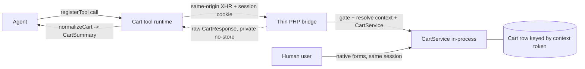

# ADR 0004 — Cart architecture: context, caching, exposure & projection

Date: 2026-07-19
Status: Accepted — **implemented** on `refactor/typescript-foundation` (not yet merged to `main`)
Relates to: [Architecture Overview](../Architecture.md) ·
[ADR 0001 — Categories via Store API](0001-categories-store-api.md) ·
[ADR 0003 — TypeScript architecture](0003-typescript-architecture.md) ·
[ADR 0006 — Tool discovery contract](0006-tool-discovery-contract.md) ·
[Cart implementation plan](../specs/0003-cart-implementation-plan.md)

> **Single source of truth for the cart.** This ADR records the *final* cart
> design across four entangled questions — context-sync, cache-safety, exposure
> mechanism, and projection location. It supersedes the earlier split between an
> "ADR 0004" (context/caching/semantics) and an "ADR 0006" (projection); those are
> folded in here. The tool-discovery / `.wmcp` decision that once lived in this ADR
> now has its own record: [ADR 0006](0006-tool-discovery-contract.md).

## Context

The cart touches four questions that were historically decided in different places
and are separated cleanly here:

1. **Context synchronisation** — how do we guarantee the agent operates on the
   *same* Shopware `SalesChannelContext` / cart row as the human shopper?
2. **Cache-safety** — how do we guarantee cart/session state never leaks into
   HTTP-cached (reverse proxy / Varnish) full-page HTML?
3. **Exposure & semantics** — is the cart driven by **imperative** executable tools
   or a **declarative** description of page affordances, and with what write
   semantics (relative delta vs. per-line target vs. full-cart replace)?
4. **Projection** — where is the raw Shopware cart shaped into the compact,
   LLM-friendly payload the tools return: in PHP or in the frontend?

There is a forward dependency: the roadmap commits to a `get_sales_channel_context`
tool (the Shopware-specific differentiator). Whatever context-resolution primitive
the cart uses must serve that too.

## Two orthogonal axes (avoid conflating "declarative")

- **Axis A — write semantics.** How an operation's *intent* is expressed: *relative
  delta* (`add 1`) vs. *per-line target* (`this line = quantity N`) vs. *full-cart
  replace* (`cart = [...]`).
- **Axis B — exposure mechanism.** How the capability is *surfaced*: *imperative*
  `registerTool` handlers vs. a *declarative* description of native forms the
  browser drives.

## Platform facts — Shopware

- **Context resolution is automatic.** A storefront-scoped
  (`_routeScope => ['storefront']`), same-origin request carrying the session
  cookie is resolved by Shopware into the shopper's `SalesChannelContext`,
  including the exact `sw-context-token` in that session. `CartService::getCart($token,
  $context)` then loads **the same cart row the shopper sees** — no client-side
  token exchange required.
- **The context token is a per-user secret.** The HTTP cache is keyed by URL +
  `sw-cache-hash` (customer group, currency, active rules, login state) — **not** by
  the individual session/cart. A cache entry is shared across *different users* with
  the same hash. Injecting the token into full-page HTML would therefore serve one
  user's token to every user sharing that cache entry → cart cross-contamination and
  session hijack. This is *why* Shopware keeps it server-side, and why a stock
  storefront exposes no readable token. Sales-channel-global, non-secret values
  (`storeApiAccessKey`, `navigationCategoryId`) are cache-safe to expose; the
  per-user token is categorically not.
- **Cache-safety is a response contract.** `GET` responses are made uncacheable with
  `Cache-Control: private, no-store`; `POST`/`PATCH`/`DELETE` are never HTTP-cached.
  `XmlHttpRequest => true` restricts a route to XHR, preventing prefetch /
  direct-navigation caching.
- **The cart is richer than `{sku: qty}`.** Promotions, vouchers, rule-inserted
  free-gift line items, bundles and nested items mean any model that lets the agent
  declare the *whole* cart risks clobbering user- or rule-owned lines and reconcile
  loops against auto-inserted gifts.
- **"Store API for cart" ≠ HTTP to `/store-api`.** The Store API cart controllers
  are thin wrappers over `CartService`. Inside a storefront PHP route we call
  `CartService` **in-process** — same result, same context, no round-trip, no token.

## Platform facts — WebMCP standard

Source: W3C Web Machine Learning CG, *WebMCP* Draft Community Group Report,
10 July 2026 (not ratified; still evolving).

- **The imperative API is fully specified.** `document.modelContext.registerTool(tool,
  options)` with `ModelContextTool = { name, title, description, inputSchema
  (JSON Schema), execute, annotations }`; `ToolAnnotations = { readOnlyHint,
  untrustedContentHint }`. This is exactly what the runtime already targets.
- **The declarative form API is explicitly incomplete.** Its section is "entirely a
  TODO"; the proposed HTML attributes and the "synthesize a declarative JSON Schema"
  algorithm are undefined. Betting the cart on it now is premature.
- **Identity inheritance is a first-class principle.** Tools "inherit user identity
  and authentication context from the browser" and run in the user's existing
  session, secure-context only, same-origin gated. This is the standard's blessing of
  exactly the Shopware mechanism above: execute same-origin and the session comes for
  free.

## Decisions

### D1 — Exposure: imperative `registerTool` (Axis B)

Keep the executable contract **imperative**. The W3C imperative API is stable,
implemented, and the only path that can express add-an-arbitrary-product, structured
reads, and `get_sales_channel_context` regardless of the current page. The
declarative form API (annotating native forms) is deferred — it is a spec TODO,
exposes only affordances present on the current page, and returns HTML/redirects
rather than structured JSON. Adopt it later *additively* as progressive enhancement
when it stabilises, without removing the imperative tools; re-open this ADR then.

### D2 — Write semantics: declarative per-line target (Axis A), two product-keyed tools

The canonical write is **per-line target** (`quantity: N` on a product-keyed line),
which is idempotent → retry-safe (the dominant agent failure mode), needs no
current-quantity bookkeeping or line-item-ID juggling, and touches only the targeted
product line → never clobbers other items, promotions, or rule-owned gifts. It also
matches Shopify's `cartLinesUpdate` model.

Two product-keyed tools:

- `add_to_cart(product, quantity = 1)` — relative convenience (discoverable verb,
  Shopify parity). Not idempotent under retry; accepted because every write returns
  full cart state for re-grounding.
- `update_line_item(product, quantity)` — declarative target, `0` = remove;
  idempotent.

Keying off product id/sku removes the DOM-based line-item lookup. `remove_from_cart`
is dropped (redundant with `update_line_item(quantity: 0)`). Full-cart replace
(`set_cart([...])`) is **rejected** — it clobbers concurrent edits and rule/promotion
lines and cannot faithfully represent the rich line-item domain.

### D3 — Execution backend: server-side `CartService` via a thin PHP bridge

Cart writes execute **server-side**, in storefront-scoped, same-origin,
`private, no-store`, `XmlHttpRequest`-restricted endpoints that resolve
`$context->getToken()` and call `CartService` in-process. This satisfies
context-sync and cache-safety **by construction** and needs **no token in the
browser**.

Why not hit the Store API cart routes directly from the browser, the way products
do? Because a usable token cannot be safely handed to the browser on a cacheable
page (see Platform facts), and the reliable alternative — the session cookie the
browser already sends — makes the thin PHP endpoint the simplest correct option:

- **Reads tolerate a missing token; cart writes do not.** Product/category reads run
  fine in an anonymous Store API context (a missing token just means default
  pricing). A cart write with a missing/wrong token writes to a *different cart than
  the shopper sees* — a correctness bug, not a degraded read. So token unavailability
  is tolerable for reads and disqualifying for cart mutations.
- **Fetching the token via an uncached AJAX call is rejected.** It puts the token
  into JS memory (widening the XSS blast radius from "read the page" to "act on the
  victim's cart and checkout as them"), adds token-lifecycle handling (the storefront
  rotates the token on login/logout/context change), and buys nothing over the
  session cookie the browser already sends.

This is the standard's "identity inheritance" applied server-side, and it is the same
primitive `get_sales_channel_context` needs — build the context-resolution endpoint
once, two consumers.

### D4 — Projection: normalize in the frontend (`domain/cart.ts`), not PHP

The thin PHP bridge **returns the raw Shopware cart** (`CartResponse` /
`StructEncoder` output); `runtime/domain/cart.ts` normalizes it into the compact
`CartSummary` before the tool returns `structuredContent`.

Rationale: products and categories already settled on "Store API + normalize in JS"
(`domain/product.ts`, `domain/category.ts`, ADR 0001). The cart was the only domain
projected elsewhere — in PHP, in a second style, in a second language. Nothing in the
projection needs data unavailable to the browser: it consumes the same price, line
items, taxes and deliveries the Store API `CartResponse` already serializes, and its
convenience fields (`cartUrl`, `checkoutUrl`, per-line `url`) are base-URL
concatenations the JS product normalizer already builds.

Verbosity never reaches the model: the raw cart travels only browser↔server
(same-origin, uncached), and `domain/cart.ts` compacts it *before* the tool returns.
The agent-facing payload is byte-for-byte today's `CartSummary`; the verbosity is
browser-internal bandwidth, not model context.

This unifies the projection layer and lets `CartPayloadBuilder` (~350 lines of PHP)
plus the controller's projection helpers be deleted, leaving PHP as a thin bridge:
config gating (disabled → `404`, enforced server-side), session-context resolution,
`CartService` write execution, and cache-safety headers.

### D5 — UI refresh: slim, native, no client-side deltas

After a write, trigger Shopware's native cart-widget/offcanvas refresh from the
authoritative server response. Drop the earlier client-side delta computation
(prev/removed/delta) — the server now returns the authoritative cart. Keep the
optional `showCartOverlay`.

### D6 — Tool discovery is out of scope here

The bespoke `.wmcp` affordance document is **removed**; `document.modelContext` (the
live registered tools) is the single source of truth for discovery. The full
reasoning is [ADR 0006 — Tool discovery contract](0006-tool-discovery-contract.md).

## Implementation status

Delivered on `refactor/typescript-foundation` (commits `0816fc2`, `a7d9d48`,
`d353a07`, `6d52b09`, `b2cd66d`): server-side `CartService` write endpoints (D3);
product-keyed `add_to_cart` + `update_line_item` with `0` = remove, `remove_from_cart`
dropped (D1/D2); the controller returns the raw `CartResponse` and `domain/cart.ts`
normalizes it, with no `CartPayloadBuilder` in the tree (D4); slimmed `cart-ui-sync`
(D5); the `.wmcp` document removed (D6, see [ADR 0006](0006-tool-discovery-contract.md));
and `get_sales_channel_context` on the shared context primitive. The step-by-step
record is in the [cart implementation plan](../specs/0003-cart-implementation-plan.md).

## Consequences

**Positive**
- Context-sync and cache-safety become structural, not incidental; no token in the
  browser; retry-safe idempotent writes; one executable contract; Shopify parity.
- One projection layer, one language: cart normalization lives next to `product.ts` /
  `category.ts`; the PHP↔JS shape drift is gone.
- Net less code: deletes the storefront-route cart writes, CSRF discovery, the DOM
  line-item lookup, `CartPayloadBuilder` (~350 lines), the delta logic, and
  `remove_from_cart`; adds thin `CartService` write endpoints and `domain/cart.ts`.

**Negative / risks**
- New server-side write endpoints replace the storefront-route writes — behaviour
  (esp. promotion / rule-gift interaction and the `cart-ui-sync` refresh) must be
  re-verified via the Playwright e2e suite.
- `domain/cart.ts` must faithfully handle the richer raw shape (promotions, free-gift
  lines, bundles, nested children, deliveries/shipping totals). Projection **parity
  with the current output must be verified** field-by-field.
- One more raw-Store-API shape the frontend depends on; parity tests must catch a
  future `CartResponse` serialization change.

## Non-goals

- The W3C declarative form path (deferred, additive later).
- Any cross-origin agent scenario — it breaks identity inheritance and reintroduces
  the token-exposure question. Out of scope.
- Moving the cart *write* to the browser. Explicitly rejected (D3).

## Verification

- **Projection parity (primary).** Playwright e2e: for representative carts — single
  product, multiple products, a variant with options, a promotion/voucher, a
  rule-inserted free gift, and a bundle/nested line item — assert the `CartSummary`
  from `get_cart` / `add_to_cart` / `update_line_item` is field-by-field equivalent
  before and after the projection move.
- **Idempotency & shared cart.** `update_line_item` is retry-safe; add-then-login-
  then-read keeps one cart (token rotation handled by per-request server-side
  resolution); writes touch only the targeted line, never promotion/gift lines
  (e2e with an active promotion).
- **Gating & cache-safety unchanged.** Each cart tool disabled → the bridge returns
  `404` server-side; bridge responses keep `Cache-Control: private, no-store` and
  stay `XmlHttpRequest`-restricted.
- **Build/type & manual.** `bun run check` + `bun run build` green, dist deployed to
  the dev shop; an agent add/update/remove is reflected in the shopper's live cart
  widget/offcanvas.

## Rollback

The projection move is behind the tool runtime and the bridge response body. If
parity regressions surface, revert to returning the `CartPayloadBuilder` projection
from the bridge without touching tool contracts — the agent-facing `CartSummary` is
identical either way.
