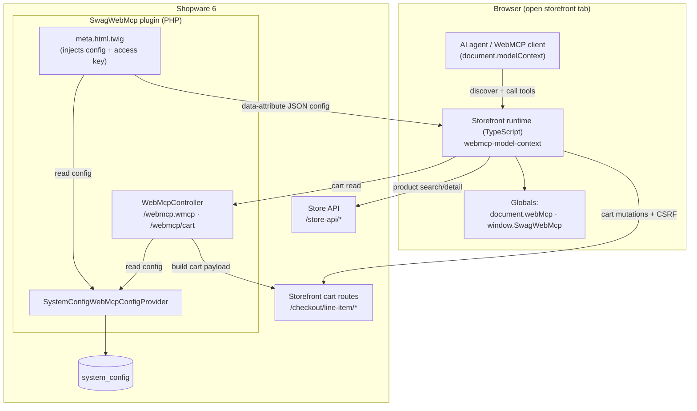
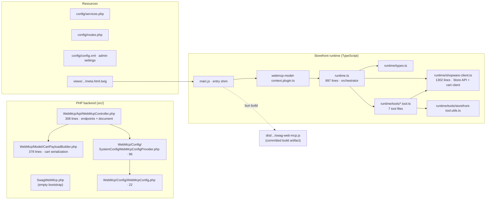
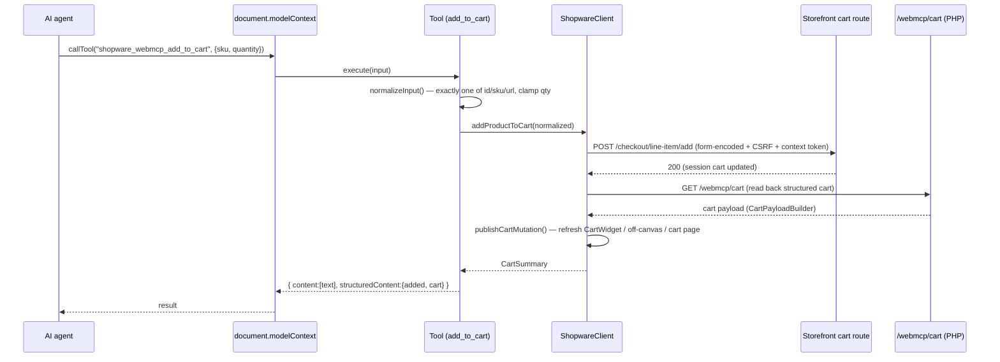
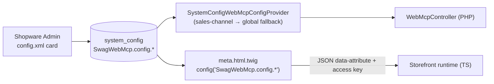
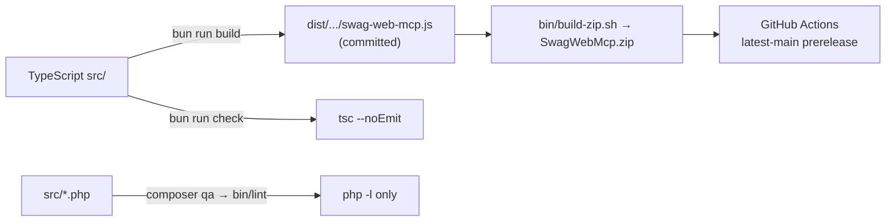

# ADR 0001 — WebMCP Plugin Architecture Overview (IST)

Date: 2026-07-17
Status: Accepted (describes the current implementation, not a target state)

> This ADR documents the **current ("IST") architecture** of the Shopware WebMCP
> plugin as of 2026-07-17. It is a reference for contributors and the baseline for
> the improvement spec in [`../specs/2026-07-17-improvements-and-roadmap.md`](../specs/2026-07-17-improvements-and-roadmap.md).
> It records what exists and why, not what should change.

## 1. Context

- Package: `shopware/web-mcp`, plugin class `Swag\WebMcp\SwagWebMcp`.
- Platform: Shopware `>=6.6.10.18 <6.8.0`, PHP `^8.2`.
- Purpose: expose a Shopware 6 storefront as a set of **WebMCP tools** so that
  AI-capable browsers can search products, inspect products, browse categories,
  and read/prepare the cart through structured, validated tool calls instead of
  scraping rendered HTML.
- Status: **research preview**, catalog + cart only. No checkout, payment, account,
  or admin operations.
- WebMCP baseline: `document.modelContext` (with compatibility shims for older
  `navigator.modelContext` / experimental testing APIs).

## 2. System context

**Key boundary:** the agent never leaves the merchant origin. It uses the
shopper's existing session (cookies + `sw-context-token`) and the public Store
API access key that Shopware already exposes to the storefront. Product reads go
through the **Store API**; cart mutations go through the **storefront cart
routes** (form-encoded + CSRF); cart reads go through the plugin's own
`/webmcp/cart` endpoint.

## 3. Component / file map

**Files over ~250 lines (flagged as large):**

| File | Lines | Role |
| --- | --- | --- |
| `runtime/shopware-client.ts` | 1302 | Store API + cart client, normalizers, cart-UI refresh, token discovery |
| `runtime.ts` | 897 | config parse, document build, tool registration, native bridge |
| `tools/get-product-categories.tool.ts` | 876 | category-tree inference from DOM/breadcrumbs |
| `Model/CartPayloadBuilder.php` | 378 | cart → JSON payload |
| `Api/WebMcpController.php` | 308 | endpoints + WebMCP document build |

## 4. PHP backend

- **Bootstrap** — `SwagWebMcp.php` is an empty `final class extends Plugin` (no
  lifecycle hooks). PSR-4 root `Swag\WebMcp\` → `src/`; subtree split into
  `Api/`, `Config/`, `Model/`.
- **Endpoints** — `WebMcpController` is a plain service (not
  `StorefrontController`) wired with `controller.service_arguments`:

  | Route | Method | Name | Content type | Cache | Disabled behavior |
  | --- | --- | --- | --- | --- | --- |
  | `/webmcp.wmcp` | GET | `frontend.swag_web_mcp.document` | `application/webmcp+json` | `public, max-age=300` | `404`, empty body |
  | `/webmcp/cart` | GET (XHR) | `frontend.swag_web_mcp.cart` | `application/json` | `private, no-store` | `404` (disabled / cart tool off), `400` (no sales-channel context) |

- **Side-car document** (`buildDocument`): `version 0.2`, `context`, `elements`
  (4 hard-coded core Shopware elements + normalized `staticElementsJson`),
  `security` (`@ADD_TO_CART` tokenised endpoint + CSRF synchroniser). Static
  elements are validated (selector/role/name), description clamped to 160 chars,
  HTTP methods whitelisted, endpoints resolved (`@`-token / root-relative /
  validated absolute URL).
- **Config** — `WebMcpConfigProviderInterface` → `SystemConfigWebMcpConfigProvider`
  reads prefix `SwagWebMcp.config.`, with sales-channel → global fallback and
  robust bool coercion.

## 5. Storefront runtime & tool call flow

Bootstrap chain: `meta.html.twig` injects a JSON `<script>` config block →
`main.js` imports the runtime and registers the plugin with `PluginManager` →
`webmcp-model-context.plugin.ts` calls `bootstrapWebMcpModelContext` →
`runtime.ts` parses config, builds the document, exposes globals, registers the
enabled tools, and bridges into the native `modelContext` API.

**Native bridging:** `runtime.ts` wraps `document.modelContext.getTools`/`callTool`
(idempotent guards) and attempts registration into the experimental native API
found on `navigator.modelContext`, `document.modelContext`, or
`navigator.modelContextTesting`, trying **four registration signatures** in
sequence for cross-preview compatibility. All failures fall back to the wrapped
`document.modelContext`.

**Two client transports** in `ShopwareClient`:

- **Store API** (`POST /store-api/*`) with `sw-access-key` + `sw-context-token`
  headers; captures and persists the returned context token to `localStorage`.
  Used for product search/detail with a rich association criteria.
- **Storefront routes** (`/checkout/line-item/add|change-quantity|delete`) as
  `application/x-www-form-urlencoded` with CSRF token for cart mutations, plus
  the plugin's `/webmcp/cart` for structured cart reads.

## 6. Tool surface

All tools are prefixed `shopware_webmcp_` and return
`{ content: [{type:'text', text}], structuredContent }`.

| Tool | Input | Output keys | Data source |
| --- | --- | --- | --- |
| `search_products` | `query?` (≤120), `limit?` (1–20, def 5) | `query, count, total, products` | Store API `/search` |
| `get_product` | one of `id`/`sku`/`url` | `lookup, product` | Store API `/product/{id}` |
| `get_product_categories` | `scope?` (tree\|product), `sku?`, `url?` | `lookup, scope, source, sourceUrl, count, activeCategoryIds, categories, tree` | **DOM/breadcrumb scraping** |
| `get_cart` | none | `cart` | `/webmcp/cart` |
| `add_to_cart` | one of id/sku/url + `quantity?` (1–100) | `added, cart` | Storefront `/checkout/line-item/add` |
| `update_line_item` | one of lineItemId/id/sku/url + **required** `quantity` (0–100) | `updated, cart` or `skipped` | change-quantity / delete |
| `remove_from_cart` | one of lineItemId/id/sku/url + `quantity?` (1–100) | `removed, cart` | change-quantity / delete |

> Note: `get_product_categories` is the only tool that does **not** use the Store
> API — it infers the category tree from the current/loaded page's navigation and
> breadcrumbs. This is a deliberate IST characteristic (and a known limitation,
> see the improvement spec).

## 7. Configuration flow

Admin settings (all default true except `context` text and empty
`staticElementsJson`): `enabled`, `context`, `staticElementsJson`, and 7 per-tool
toggles (`searchProductsToolEnabled`, `getProductToolEnabled`,
`getProductCategoriesToolEnabled`, `getCartToolEnabled`, `addToCartToolEnabled`,
`updateLineItemToolEnabled`, `removeFromCartToolEnabled`).

The config reaches the runtime in two independent ways: PHP reads it via the
provider; the storefront reads it via Twig, which emits the enabled toggles and
the public `storeApiAccessKey` into a `data-*` attribute the runtime parses.

## 8. Build, QA & release

- `composer qa` / `docker compose run --rm qa` run **only PHP `php -l` syntax
  linting** — no PHPStan/Psalm/CS-Fixer/PHPUnit.
- `bun run check` (TS type-check) runs **only** inside `bin/build-zip.sh`, not in
  the default `qa` target.
- `bin/build-storefront-dist.ts` bundles `main.js` with `Bun.build` (IIFE,
  minified) into the committed `dist` artifact required for Admin ZIP installs.
- No tests exist (`0%` coverage); the only verification is lint + type-check.

## 9. Notable IST characteristics (carried into the improvement spec)

These are recorded here as facts; rationale and remediation live in the spec.

- **Dual contract**: the WebMCP document/element/security contract is implemented
  **twice** — in PHP (`WebMcpController`) and in TypeScript (`runtime.ts`) — with
  no single source of truth (drift risk).
- **God modules**: `shopware-client.ts` (1302) and `runtime.ts` (897) mix many
  responsibilities; `get-product-categories.tool.ts` (876) embeds a full
  tree-inference engine.
- **Per-tool boilerplate**: the "exactly one of id/sku/url" validator,
  `normalizeQuantity`, and `MAX_*` constants are copy-pasted across tool files.
- **Defensive weak typing (PHP)**: the config provider takes `object`/`mixed`
  instead of concrete Shopware types; `method_exists()` guards pervade the code.
- **Silent failure**: invalid `staticElementsJson` and many `catch { /* ignore */ }`
  blocks fail without signal; combined with 0 tests and no logging, failures are
  invisible.
- **Stale AGENTS.md**: references a `src/Resources/public` vanilla-JS runtime that
  no longer exists (the runtime is TypeScript under `app/storefront/src`).
