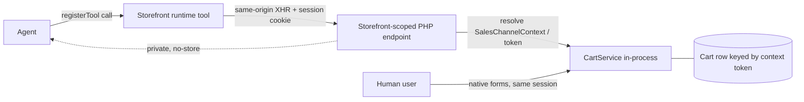

# ADR 0005 — Cart: session context, caching & declarative vs. imperative exposure

Date: 2026-07-18
Status: **Accepted** (2026-07-18)
Relates to: [ADR 0001 — Architecture Overview](2026-07-17-architecture-overview.md) ·
[ADR 0002 — Categories via Store API](2026-07-17-categories-store-api.md) ·
[Improvements & Roadmap](../specs/2026-07-17-improvements-and-roadmap.md)
(`get_sales_channel_context`, item B1) ·
[Module structure](../specs/2026-07-18-module-structure-and-adapters.md)

> Accepted with the two-tool variant of resolution 1 (`add_to_cart` +
> `update_line_item`). See the resolutions section for the full decision. Grounded
> in both the Shopware platform and the WebMCP standard. Implementation plan:
> [Cart architecture implementation plan](../specs/2026-07-18-cart-implementation-plan.md).

## Context

Today the cart is driven **imperatively** and its **writes ride the classic
storefront routes** (`/checkout/line-item/{add,change-quantity,delete}`,
form-encoded + CSRF, `credentials: 'same-origin'`). This was a deliberate,
conservative choice: riding the session cookie guarantees the agent and the user
share the same cart without exposing any token. Reads already go through a custom
server-side endpoint (`/webmcp/cart`, `CartService::getCart($ctx->getToken())`,
`Cache-Control: private, no-store`). Product/category reads use the Store API.

Three questions surfaced and are entangled; this ADR separates them:

1. **Context synchronisation** — how do we guarantee the agent operates on the
   *same* Shopware `SalesChannelContext` / cart as the human user?
2. **Caching** — how do we guarantee cart/session state never leaks into
   HTTP-cached (reverse proxy / Varnish) full-page HTML?
3. **Exposure model** — should the cart be **imperative** (bespoke tools that
   execute a request) or **declarative** (describe the page's real affordances /
   forms and let them be driven), and with what **state semantics** (delta vs.
   target-quantity)?

There is also a forward dependency: the roadmap commits to a
`get_sales_channel_context` tool (the Shopware-specific differentiator). Whatever
context-resolution primitive we build for the cart should serve that too.

### Verified current state

| Concern | Today |
| --- | --- |
| Cart read (`get_cart`) | server-side `/webmcp/cart`, `CartService`, `private, no-store` |
| Cart writes | storefront routes, POST + CSRF, same-origin cookie session |
| Product/category reads | Store API (`sw-access-key` + discovered `sw-context-token`) |
| Tool registration | **imperative** — `native-bridge.ts` → `document.modelContext.registerTool` (+ polyfill), matching the W3C imperative dictionary 1:1 |
| Second contract | PHP `/webmcp.wmcp` emits a **bespoke declarative affordance document** (`version 0.2`: `elements[]` with `selector`/`role`/`action`/`csrf_tag`, `security.endpoints[].scopes`) — **not** the W3C shape |
| Token exposure | `contextToken` is **not** injected into cached HTML; `readContextToken()` typically returns `null` on a stock storefront (Store-API cart calls would otherwise run in an anonymous context) |

Note the **dual contract**: an imperative tool registry (executable) *and* a
custom declarative `.wmcp` document (descriptive) are maintained separately — a
known drift risk.

## Two orthogonal axes

Discussions conflate two different meanings of "declarative". They are
independent and must be decided separately:

- **Axis A — state semantics.** How an operation's *intent* is expressed:
  *imperative delta* (`add 1`) vs. *declarative target* (`this line = quantity N`)
  vs. *full-cart replace* (`cart = [...]`).
- **Axis B — exposure mechanism.** How the capability is *surfaced* to the agent:
  *imperative* `registerTool` handlers vs. *declarative* description of the page's
  native forms/affordances that the browser drives.

## Platform facts — Shopware

- **Context resolution is automatic.** A storefront-scoped
  (`_routeScope => ['storefront']`), same-origin request carrying the session
  cookie is resolved by Shopware into the user's `SalesChannelContext` — including
  the exact `sw-context-token` in the user's session. `CartService::getCart($token,
  $context)` then loads the cart keyed by that token: **the same row the user
  sees.** No client-side token exchange is required.
- **The context token is a per-user secret.** The HTTP cache is keyed by URL +
  `sw-cache-hash` (customer group, currency, rules, login state) — **not** by the
  individual session/cart. Injecting the token into full-page HTML (e.g.
  `meta.html.twig`) would serve one user's token to every user sharing a cache
  entry → cart cross-contamination + session hijack. This is *why* Shopware keeps
  it server-side. (Sales-channel-global, non-secret values such as
  `storeApiAccessKey` / `navigationCategoryId` are cache-safe there; the token is
  categorically not.)
- **Cache-safety is a response contract.** `GET` responses are made uncacheable
  with `Cache-Control: private, no-store` (already done for `/webmcp/cart`);
  `POST`/`PATCH`/`DELETE` are never HTTP-cached anyway. `XmlHttpRequest => true`
  restricts a route to XHR, preventing prefetch/direct-navigation caching.
- **The cart is richer than `{sku: qty}`.** Promotions, vouchers, rule-inserted
  free-gift line items, bundles, nested items. Any model that lets the agent
  declare the *whole* cart risks clobbering user- or rule-owned line items and can
  cause reconcile loops against auto-inserted gifts.
- **"Store API for cart" ≠ HTTP to `/store-api`.** The Store API cart controllers
  are thin wrappers over `CartService`. Inside a storefront PHP route we can call
  `CartService` **in-process** — same result, same context, no round-trip, no
  token needed.

## Platform facts — WebMCP standard

Source: W3C Web Machine Learning CG, *WebMCP* Draft Community Group Report,
10 July 2026 (not a ratified standard; still evolving).

- **Imperative API is fully specified.** `document.modelContext.registerTool(tool,
  options)` with `ModelContextTool = { name, title, description, inputSchema
  (JSON Schema), execute (async → Promise<any>), annotations }`; `ToolAnnotations
  = { readOnlyHint, untrustedContentHint }`; options `{ signal, exposedTo }`. This
  is exactly what the plugin's runtime already targets.
- **Declarative form API is explicitly incomplete.** The spec's declarative
  section is "**entirely a TODO**"; the proposed HTML attributes
  (`toolname` / `tooldescription` / `toolautosubmit`) and the "synthesize a
  declarative JSON Schema" algorithm are not yet defined. **Betting the cart on
  the standardised declarative-form path now is premature.**
- **Identity inheritance is a first-class principle.** Tools "inherit user
  identity and authentication context from the browser" and run in the user's
  existing session, secure-context (HTTPS) only, same-origin gated via `exposedTo`
  / the `tools` permissions policy (default `['self']`). This is the standard's
  blessing of exactly the Shopware mechanism above: **execute same-origin and the
  session comes for free.**

## Options

### Axis B — exposure mechanism

**B1 — Imperative `registerTool` (status quo mechanism).**
Executable tools with JSON-Schema inputs and structured JSON returns.
- ➕ Fully W3C-specified and already implemented; matches the spec dictionary 1:1.
- ➕ Works regardless of what is on the current page — can add an *arbitrary*
  product from a chat without navigating there first.
- ➕ Returns structured cart state (via `CartPayloadBuilder`) for agent grounding.
- ➕ `execute()` runs same-origin → identity inheritance gives us context for free.
- ➖ We author and maintain the tool + its executor; cache/context-safety is our
  responsibility (satisfied by the server-side endpoint pattern below).

**B2 — W3C declarative form API (`toolname`/… on native forms).**
Annotate the storefront's real forms; the browser drives them.
- ➕ Zero-JS; inherits session, CSRF, and cache-safety *for free* (a native POST to
  the storefront's own route).
- ➕ Single source of truth — the real form; no drift from a reimplemented request.
- ➕ Robust to theme/plugin form customisations (extra B2B fields, etc.).
- ➖ **Spec is a TODO** — unstable, not implementable to a fixed contract today.
- ➖ Only exposes affordances **present on the current page** (the add form lives on
  a product detail page) → cannot express "add arbitrary product" or catalogue-wide
  actions without navigation.
- ➖ Native submits return **HTML/redirects**, not structured JSON → poor for reads.
- ➖ No idempotency / target-quantity semantics unless the underlying form has them.

**B3 — Bespoke `.wmcp` affordance document (status quo second contract).**
The custom PHP-emitted descriptor.
- ➕ Already exists; can carry roles/scopes/CSRF hints.
- ➖ Proprietary, non-standard → low host/agent interop.
- ➖ **Dual-contract drift** against the imperative runtime (a known Baustelle).

### Axis A — state semantics (for the write path)

**A1 — Imperative delta** (`add_to_cart(qty=+N)`).
- ➖ Not idempotent → agent retries / duplicated tool calls double-add.
- ➖ Relative ops need the *current* quantity → extra read + race window
  (`findStorefrontCartLineItem`), fragile under a concurrent human editor.

**A2 — Declarative per-line target** (`set_line_item(product, quantity)`,
`0` = remove). PUT semantics on the product-keyed line.
- ➕ Idempotent → retry-safe (the dominant agent failure mode).
- ➕ No current-quantity bookkeeping, no line-item-ID juggling.
- ➕ Touches only that one product line → does **not** clobber other items,
  promotions, or rule-owned gifts → safe under the shared human+agent cart.
- ➕ Matches Shopify's cart model (`cartLinesUpdate` takes a target quantity per
  line) → aligns with the Shopify-parity roadmap (ACL-131/132).
- ➖ Pure "set N" cannot express "add 2 more" without a prior read (cheap; or keep
  a thin relative helper).

**A3 — Full-cart declarative replace** (`set_cart([...])`).
- ➕ Maximally idempotent; single expression of intent.
- ➖ **Clobbers** the user's concurrent edits and rule/promotion line items.
- ➖ Cannot faithfully represent the rich line-item domain → reconcile loops.
- ✗ Rejected for a shared, rule-driven cart.

### Execution backend (cross-cutting, Shopware)

**E1 — Storefront routes (status quo writes).** Same context (cookie) + uncached
(POST) already hold, but: form-encoded, DOM-scraped CSRF, HTML responses,
DOM-based line-item lookup.
**E2 — Server-side `CartService` endpoints.** Storefront-scoped, same-origin,
`private, no-store`, resolve `$context->getToken()`, call `CartService`
in-process. Same context + uncached + **no token exposure**; clean JSON; no CSRF
scraping; no DOM lookup. This is the same primitive `get_sales_channel_context`
needs.

## Recommendation (founded, for discussion)

A **hybrid** that takes the stable parts of each and defers the unstable one:

1. **Exposure: keep the executable contract imperative (B1).** The W3C imperative
   API is stable, already implemented, and is the *only* path that can express
   add-arbitrary-product, structured reads, and `get_sales_channel_context`. The
   declarative form API (B2) is a TODO in the spec — do not bet the cart on it now.
2. **Semantics: make the canonical write declarative-per-line (A2).**
   `set_line_item(product, quantity)`, `0` = remove, idempotent. Keep `add_to_cart`
   only as an explicit relative convenience with the delta semantics documented in
   its description; `remove_from_cart` becomes redundant. Return full cart state on
   every op. (`update_line_item` is already essentially A2 — this formalises and
   re-keys it from `lineItemId` to product.)
3. **Backend: execute server-side via `CartService` (E2).** Storefront-scoped,
   same-origin, `private, no-store` endpoints resolving `$context->getToken()`.
   This satisfies context-sync and cache-safety by construction and needs **no
   token in the browser** — closing the original Store-API concern. It is also the
   standard's "identity inheritance" applied server-side.
4. **Converge the contracts.** Treat the imperative tool registry as the single
   source of truth; **derive or drop** the bespoke `.wmcp` affordance document
   rather than hand-maintaining a second contract. Keep `.wmcp` (if at all) as an
   optional *hint* layer, never a second executable contract.
5. **Adopt the W3C declarative form API later, additively.** When that part of the
   spec stabilises, annotate native storefront forms as progressive enhancement
   (they then inherit session/cache for free) *without* removing the imperative
   tools. Re-open this ADR at that point.
6. **`get_sales_channel_context` shares the plumbing.** It is another imperative
   read tool (`readOnlyHint: true`) that resolves the same server-side
   `SalesChannelContext`. Build the context-resolution endpoint once; the cart and
   the differentiator both consume it.

## Consequences

- **Positive:** context-sync and cache-safety become structural, not incidental;
  no token exposure; retry-safe idempotent writes; a single executable contract;
  clean JSON; shared plumbing with `get_sales_channel_context`; Shopify parity.
- **Cost/risk:** new server-side write endpoints replace the storefront-route
  writes (behaviour must be re-verified via the Playwright e2e suite, esp.
  promotion / rule-gift interaction and the UI refresh via `cart-ui-sync`);
  re-keying `set_line_item` from `lineItemId` to product changes the tool contract;
  converging `.wmcp` touches the PHP document builder.
- **Deferred:** the W3C declarative form path; any cross-origin agent scenario
  (which would break identity inheritance and reintroduce the token-exposure
  question) is explicitly out of scope.

## Resolutions (proposed 2026-07-18 — pending final sign-off)

Decided against four goals: cart sync, cache-safety, minimal code surface, and a
relevant/helpful tool set.

1. **Tool surface — two product-keyed write tools; drop `remove_from_cart`.**
   `add_to_cart(product, quantity=1)` (relative; discoverable verb; Shopify parity)
   and `update_line_item(product, quantity)` (declarative target, `0` = remove;
   idempotent). Keying off product id/sku removes the DOM-based
   `findStorefrontCartLineItem`. Residual risk: `add` is not idempotent under retry
   — accepted, because every write returns full cart state for re-grounding.
   *More minimal alternative:* a single `set_line_item(product, quantity)`
   (drop `add_to_cart` too) — fully idempotent, smallest surface, at the cost of a
   prior read for relative "add N more". Chosen: **two tools** unless LOC is
   weighted hardest, then the single-tool variant.
2. **`.wmcp` — auto-derive (DECIDED).** The imperative tool registry is the single
   source of truth; `.wmcp` becomes a projection of the tool list
   (name/description/inputSchema/annotations). This removes the bespoke
   DOM-affordance machinery in `WebMcpController` (`coreShopwareElements`,
   `normalizeElement`/`normalizeAction`, `selector`/`role`/`action`/`csrf_tag`
   model, `securityDefinition`) — a legacy of DOM-driving that the imperative
   contract no longer needs. Single manifest delivered PHP→TS via the existing
   config pipe; both `.wmcp` and the runtime derive from it.
3. **`get_cart` stays server-side, co-located.** No behavioural change. New write
   endpoints live in the same controller and reuse `CartPayloadBuilder`, so reads
   and writes return an identical cart shape (less code, consistent grounding).
4. **UI refresh — keep, but slim.** Drop the client-side delta computation in
   `cart-ui-sync` (`publishCartMutation` prev/removed/delta): the server now returns
   the authoritative cart, so trigger Shopware's native cart-widget/offcanvas
   refresh instead. Keep the optional `showCartOverlay`.

**Net code-surface effect:** deletes `storefront-cart.ts`, cart CSRF discovery,
`findStorefrontCartLineItem`, the delta logic in `cart-ui-sync`, `remove_from_cart`,
and the `.wmcp` affordance machinery; adds thin `CartService` write endpoints and
the `.wmcp` projection. Net **less** code, with sync + cache-safety structural
rather than incidental.

`get_sales_channel_context` reuses the same server-side context-resolution
primitive as the cart — one endpoint pattern, two consumers.
