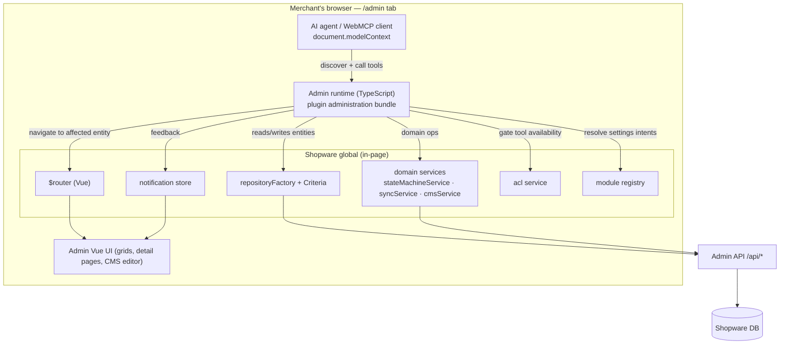

# Spec — WebMCP in the Shopware Admin

Date: 2026-07-19
Status: Draft — not started
Baseline: [Architecture Overview](../Architecture.md),
[ADR 0005 — Admin runtime & API strategy](../adr/0005-admin-runtime-and-api-strategy.md)
Sources: current codebase (IST), Shopware Administration internals
(`repositoryFactory`, `Criteria`, `stateMachineService`, `cms_page` DAL, module
registry), Linear project *WebMCP Support*.

## Goal

Let a merchant who is **logged into and working in the Shopware Administration**
drive the admin through natural language via an AI-capable browser, and *see it
happen* in the real UI. Concretely, the merchant should be able to say things like:

- "Mark order **10023** as completed." → transition the order state.
- "Which orders are still open?" → list orders filtered by state, show them.
- "Show me all products with **FoO** in the name." → product search, open the list.
- "Create a new design for category **XYZ**: a large image at the top with the
  text **ABC** to its right." → build a CMS layout and assign it to the category.
- "Where do I configure the robots.txt / take me to the WebMCP settings." →
  resolve the intent to an admin route and navigate there.

The capability should cover the everyday admin surface — **products, orders,
categories, CMS/landing/content pages, and navigation to settings** — as broadly
as is safe, while the merchant stays in control and watches each action land.

This spec is a design & backlog record. It does not implement anything. The two
load-bearing architecture decisions live in [ADR 0005](../adr/0005-admin-runtime-and-api-strategy.md);
this document assumes them:

1. A **separate admin runtime** in the plugin's `administration` bundle, sharing a
   `webmcp-core` (tool factory, zod→JSON-Schema, model-context bridge, safety
   hints) with the storefront runtime.
2. Tools drive the **admin's own JS layer** (`repositoryFactory` / domain services
   / Vue `$router` / notification store), **not** a direct Admin-API client or new
   server endpoints — so they inherit the merchant's live session and ACL and the
   UI reflects every change.

## Context

- The admin is a Vue SPA. A plugin's `administration` bundle runs in-process inside
  it and can import the global `Shopware` object: `Service('repositoryFactory')`,
  `Data.Criteria`, `Context.api`, `Service('stateMachineService')`,
  `Service('acl')`, `Module.getModuleRegistry()`, and the root `$router`.
- Everything an admin *page* does — search a grid, save a detail form, transition
  an order, compose a CMS layout — is reachable through those same JS APIs.
- The storefront runtime already gives us the reusable machinery: the `defineTool`
  factory with a single zod schema producing both validator and advertised JSON
  Schema, the `readOnlyHint` / `untrustedContentHint` safety annotations, and the
  native `modelContext` bridge with idempotent registration.

**Key boundary:** the agent never leaves the admin origin and never handles a
token. It acts *through* the logged-in merchant's session and ACL. A tool the user
lacks the privilege for is not even advertised.

## Requirements

- **Must** register admin tools into `document.modelContext` only inside the admin
  SPA (feature-detect `window.Shopware`); never in a storefront tab.
- **Must** perform all reads/writes through the admin JS layer
  (`repositoryFactory` + `Criteria` + `Context.api`, or the matching domain
  service), inheriting the merchant's session and ACL.
- **Must** gate every tool on the corresponding ACL privilege via
  `Service('acl').can(...)`; unavailable tools are not registered.
- **Must** classify every tool with `readOnlyHint` / `untrustedContentHint`, and
  require **explicit confirmation** for destructive or high-impact writes
  (state transitions on real orders, deletes, publishing a CMS layout live).
- **Must** make actions **visible**: after a mutation, navigate to the affected
  entity via `$router` and raise a notification, so the merchant sees the result.
- **Must** feature-detect admin-internal access points (Vuex `State` vs Pinia
  `Store`, router access) and degrade gracefully across the supported Shopware
  range.
- **Must** keep the shared `webmcp-core` free of environment-specific code; the
  storefront runtime keeps working unchanged.
- **Must not** open a direct `/api/*` client with its own token handling, add
  server-side plugin endpoints for admin actions, or bypass admin validation.
- **Must not** expose checkout/payment execution, customer PII export, user/role
  administration, or plugin (de)installation in the initial scope (see Non-Goals).

## Tool surface (proposed)

All admin tools are namespaced `admin_` (distinct from the storefront
`shopware_webmcp_` prefix) and built with the shared `defineTool` factory. Reads
carry `readOnlyHint: true`; anything rendering merchant/customer text carries
`untrustedContentHint: true`; writes carry a confirmation requirement.

### Context & navigation

| Tool | Kind | Input | Does | Backing |
| --- | --- | --- | --- | --- |
| `admin_get_context` | read | — | current user, locale, admin version, active route, ACL summary, sales channels | `Context.api`, session, `repositoryFactory('sales_channel')` |
| `admin_navigate` | action | route name or intent + params | push a named admin route so the merchant lands on the page | `$router.push` |
| `admin_find_setting` | read | natural-language `query` | resolve "robots.txt", "WebMCP settings", "shipping methods", … to admin route(s) + deep link, ranked | module/settings registry index (see below) |

`admin_find_setting` + `admin_navigate` together answer *"where do I configure X"*
and *"take me there"* — the merchant asks, the tool returns the best match, and
navigation puts them on the page. The index is built from
`Shopware.Module.getModuleRegistry()` and the settings-items registry, augmented
with a small curated synonym map (e.g. *robots.txt → SEO settings*,
*WebMCP → this plugin's config*, *tax → settings/tax*).

### Products

| Tool | Kind | Input | Does |
| --- | --- | --- | --- |
| `admin_search_products` | read | `query?`, filters (active, stock, manufacturer, category), `limit?` | search the `product` entity, return matches; optionally open the product list filtered |
| `admin_get_product` | read | `id`/`number` | full product incl. prices, stock, categories, media, visibilities |
| `admin_create_product` | write | name, number, price, tax, stock, active, category ids, … | `repository.create` + `save` a new product |
| `admin_update_product` | write | selector + patch (name, description, price, stock, active, category assignments, media) | partial `save` |
| `admin_resolve_variant` | read | product + option selection | resolve options → concrete variant id before edits/orders (Shopware variants are a known agent pain point) |
| `admin_navigate_to_product` | action | selector | `$router.push('sw.product.detail', { id })` |

### Orders

| Tool | Kind | Input | Does |
| --- | --- | --- | --- |
| `admin_list_orders` | read | filters (state = open/in_progress/completed/cancelled, payment/delivery state, date range, customer, sales channel), `limit?` | search `order`; "which orders are open?" |
| `admin_get_order` | read | order number or id | order detail: line items, totals, states, addresses, transactions, deliveries |
| `admin_transition_order_state` | write (confirm) | order selector + target (`complete`/`cancel`/`process`/…) | `stateMachineService.transitionState('order', …)` — "mark ABC as completed" |
| `admin_transition_delivery_state` | write (confirm) | order + target (`ship`/`ship_partially`/…) | delivery state machine |
| `admin_transition_payment_state` | write (confirm) | order + target (`paid`/`refund`/…) | transaction state machine |
| `admin_generate_document` | write (confirm) | order + type (invoice/delivery_note/…) | document service |
| `admin_navigate_to_order` | action | selector | open the order detail page |

### Categories

| Tool | Kind | Input | Does |
| --- | --- | --- | --- |
| `admin_list_categories` | read | `parentId?`, `query?` | category tree / search |
| `admin_create_category` | write | name, parentId, active, type | `repository.create` + `save` |
| `admin_update_category` | write | selector + patch (name, active, parent, SEO, `cmsPageId`) | partial `save` |
| `admin_assign_layout` | write (confirm) | category selector + cms page id | set `category.cmsPageId` — links a design to a category |
| `admin_navigate_to_category` | action | selector | open category detail |

### CMS / landing / content pages

The hard one. Raw `cms_page` structure is `sections → blocks → slots`, each slot a
typed component with a `config`. Exposing that verbatim to an agent is error-prone,
so we expose a **block-template abstraction**: a curated library of composable,
parameterized blocks (`hero_image`, `image_with_text`, `text`, `product_listing`,
`image_gallery`, `banner`, …) plus a low-level escape hatch. "A large image at the
top with the text ABC to its right" maps to one `image_with_text` block (image
left/right + rich text) inside a full-width section.

| Tool | Kind | Input | Does |
| --- | --- | --- | --- |
| `admin_list_cms_pages` | read | `query?`, type (page/landingpage/product_detail) | search `cms_page` |
| `admin_get_cms_page` | read | id | page structure summarized as blocks |
| `admin_list_cms_block_templates` | read | — | the block-template catalog + each block's parameters (so the agent knows what it can compose) |
| `admin_create_cms_page` | write (confirm) | name, type, `blocks[]` (template + params) | compose sections/blocks/slots from templates, `repository.create` + `save` |
| `admin_update_cms_page` | write (confirm) | id + block ops (add/replace/reorder/remove) | edit an existing layout |
| `admin_create_landing_page` | write (confirm) | name, sales channel, url, `blocks[]` | `landing_page` entity + layout |
| `admin_navigate_to_cms_page` | action | id | open the CMS editor on that page |

### Search / customers (read, later phase)

| Tool | Kind | Input | Does |
| --- | --- | --- | --- |
| `admin_search_customers` | read | `query?`, filters | find customers (no PII export; summary fields only) |
| `admin_global_search` | read | `query` | the admin's global search across entities, to mirror the top search bar |

## Cross-cutting design

### Selector & factory reuse

Reuse the shared "exactly one of …" selector pattern from `webmcp-core`, extended
for admin identifiers (entity `id`, human `number`/`name`). Each tool file stays
schema + description + execute; validation, clamping and safety hints come from the
factory.

### ACL gating

At registration, the runtime asks `Service('acl').can(privilege)` per tool and only
registers the ones the user may perform (`product.editor`, `order.editor`,
`order_state.update`, `cms.editor`, `category.editor`, …). This keeps the advertised
surface honest and pushes authorization onto Shopware's own model.

### Visibility & confirmation

- Reads may optionally navigate (e.g. open the filtered list) so the merchant sees
  the data.
- Writes: after `save`/transition, raise a success notification and `$router.push`
  to the affected entity. High-impact writes (order state, deletes, publishing a
  live layout) require a confirmation step surfaced through the WebMCP confirmation
  hint / a plugin confirmation policy configurable in admin settings.
- Errors from the repository/service (validation, ACL, version conflict) are
  surfaced verbatim to the agent and as an admin notification, never swallowed.

### Settings-navigation index

`admin_find_setting` builds its index once from `Module.getModuleRegistry()` (route
names, titles, privileges) + the settings-items registry, ranked by fuzzy match
over title/route/synonyms, with a curated synonym map for the non-obvious intents
(robots.txt, WebMCP, cache, sitemap, …). Returns route name + params so
`admin_navigate` can jump there.

### Compatibility

Feature-detect the access points that moved across majors — Vuex `State.dispatch`
vs Pinia `Store.get` for notifications, and root-instance router access — behind a
thin `webmcp-admin/bridge` adapter, so a single code path serves the supported
Shopware range. CI runs the admin e2e suite against the supported versions.

## Phased roadmap

Ordering blends value, safety, and dependency. Each phase is shippable.

| Phase | Scope | Why first / notes |
| --- | --- | --- |
| **0 — Foundation** | Extract `webmcp-core`; add the `administration` bundle + admin build path (CI + ZIP); admin runtime boots, feature-detects `Shopware`, registers a single `admin_get_context` read tool; ACL gating + bridge adapter in place | De-risks the runtime/build/compat before any real tool; proves the whole chain |
| **1 — Read & navigate** | `admin_search_products`, `admin_get_product`, `admin_list_orders`, `admin_get_order`, `admin_list_categories`, `admin_navigate`, `admin_find_setting` (+ index) | All read/navigate → no destructive risk; already covers "which orders are open", "products with FoO", "take me to X" |
| **2 — Order operations** | `admin_transition_order_state` (+ delivery/payment), `admin_generate_document`, confirmation policy + admin toggle | Highest-value writes; "mark ABC completed"; forces the confirmation/visibility model |
| **3 — Product & category writes** | `admin_create_product`, `admin_update_product`, `admin_resolve_variant`, `admin_create_category`, `admin_update_category`, `admin_assign_layout` | Everyday catalog editing; variant helper unblocks reliable product ops |
| **4 — CMS builder** | block-template library, `admin_list_cms_block_templates`, `admin_create_cms_page`, `admin_update_cms_page`, `admin_create_landing_page`, `admin_assign_layout` end-to-end | Most complex; the "new design for category XYZ" story; depends on the block abstraction |
| **5 — Breadth & polish** | `admin_search_customers`, `admin_global_search`, richer filters, admin settings card for per-tool + read/write kill-switches, audit logging | Parity & governance |

## Non-Goals

- Executing checkout/payment, refunding money, or anything that moves funds beyond
  a merchant-confirmed order state/document.
- User, role, or ACL administration; plugin (de)installation; system/store settings
  *mutation* (navigation to settings is in scope; changing them via tools is not,
  initially).
- Bulk destructive operations (mass delete) without an explicit, per-item confirmed
  flow.
- Customer PII export.
- A direct Admin-API client or new server-side endpoints (see ADR 0005).

## Risks

- **Admin-internal API drift** — `Shopware.*` globals shift across majors (Vuex →
  Pinia, router access, service names). *Mitigation:* the `webmcp-admin/bridge`
  adapter + feature detection + CI across the supported version range.
- **Destructive writes on live data** — an agent transitioning the wrong order or
  publishing a broken layout. *Mitigation:* ACL gating, mandatory confirmation for
  high-impact writes, visible navigation to the affected entity, verbatim error
  surfacing, audit logging (Phase 5).
- **Prompt injection via merchant/customer content** — product descriptions, order
  notes, customer names are attacker-influenceable. *Mitigation:*
  `untrustedContentHint` on every tool returning such text; never auto-execute a
  write inferred purely from returned content.
- **CMS complexity** — raw slot config is easy to get wrong and easy to corrupt a
  page with. *Mitigation:* the curated block-template abstraction; the low-level
  escape hatch is opt-in and confirmation-gated.
- **Bundle growth** — the admin runtime concentrates real logic (variant
  resolution, CMS composition, settings index). *Mitigation:* apply the module
  discipline the storefront runtime now has from the start.

## Verification (of the follow-up work)

Each phase ships with: `bun run check` + admin build green, `composer qa` green,
an admin e2e test driving `document.modelContext` inside a real `/admin` against the
dev shop (ADR 0002 pattern extended to admin), and — for writes — a test proving
(a) the change lands and is visible in the UI, (b) an ACL-restricted user does not
get the tool and a forced call fails authorization, and (c) high-impact writes
require confirmation. The README/tool tables and this spec's status are updated per
phase.

## Open questions

1. **Distribution** — plugin-only (in-process, full capability, chosen here) vs.
   also offering a Meteor Admin SDK app variant later (sandboxed, limited). Default:
   plugin-only now; revisit if an app-store distribution is needed.
2. **Confirmation surface** — rely on the WebMCP native confirmation hint, a
   plugin-rendered admin modal, or both? Default: native hint + a plugin policy
   toggle, mirroring the storefront cart-confirmation direction.
3. **CMS block-template catalog scope** — how many templates in Phase 4? Default:
   start with the 5–6 highest-use blocks (`hero_image`, `image_with_text`, `text`,
   `product_listing`, `image_gallery`, `banner`) + escape hatch.
4. **Tool-name alignment** — keep `admin_*`, or align with a broader naming policy
   (cf. ACL-131 for the storefront). Default: `admin_*` now, fold into the global
   naming decision later.
